Chapter 14
----------
# Node Microservices with Docker and AWS ECS

Node and microservices fit together like nuts and honey, like SPF 50 and Cancun, like... you got the idea. Some of you might not even know exactly what the hell microservices are. Let me give you my brief definition. 

Microservices are small services. A microservice will have just one functionality but it will have everything that functionality needs. 

Let's say you have a service which is giving you an interface to a cookie machine. You can bake a cookie, save a template of a new cookie recipe (gluten-free!), get stats on cookie production, and all other boring but necessary stuff a service can do such called CRUD from create, read, update and delete. 

To continue with this example, now your task is to break this monolithic service into microservices. One microservice will be baking cookies. Another microservice will be saving new cookie recipes for baking by the first microservice or whatever. In other words, instead of a single application with one staging, one CI/CD and one production, now you have several applications each with their own staging environment, CI/CD, production environment and other hassle. 

Why bother? Because microservices will allow you to scale up or down different part of your system independently. Let's say, there's very little need for new recipes but a huge demand for the orders coming from chat bots (yet another microservice). Good. With microservices, you can scale just the chat bot cookie ordering microservice (app) and not waste your precious pennies on scaling any other services. On the other hand, with monolithic app, you have to scale everything at once which of course takes up more RAM, CPU, and coffee consumed. 

There's a fancy term in computer science which will make you look smart (if you work in enterprise) or snobbish (if you work in a startup). Nevertheless, This term describes microservices philosophy nicely. It's *loose coupling* and according to many CS books and classes, if you use it you'll get flexibility, ease of maintenance and enough health to enjoy your retirement.

As with many tech concepts, microservices technology goes through the cycle of over hype. There are advantages and disadvantages. Uber for example has over 2500 microservices and its engineers hate it cause of complexity and other issue of managing so many separate apps. Hate it or love it, the best thing is to know how to use it and use microservices when you see a fit. Again, Node is brilliant at that cause it's light weight, fast and because most developers are lazy to learn or code in a normal server-side language like Go or Java.

The project of creating microservice in container and deploying it to cloud is divided into three parts:

1. Creating a local Node project which is a microservice RESTful API that connects to MongoDB
1. Dockerizing Node project, i.e., turning a local project into a Docker image
1. Use Docker networks for multi-container setup
1. Deploying Docker microservice image to cloud namely Amazon Web Services Elastic Container Service

# Installing Installations

But before doing the exercise in this chapter, make sure you have the following: 

1. Docker engine
1. Amazon Web Services (AWS) account
1. AWS CLI (`aws-cli`)


## Installing Docker Engine

Next, you would need to get the Docker engine (deamon). If you are a macOS user like I am, then the easiest way is to just go to the official Docker website <https://docs.docker.com/docker-for-mac>.

If you are not a macOS user, then you can select one of the options from this page: <https://docs.docker.com/engine/installation>.


To verify installation, run

```
docker version
```

It's good if you see something like this:

```
Client:
 Version:      17.03.1-ce
 API version:  1.27
 Go version:   go1.7.5
 Git commit:   c6d412e
 Built:        Tue Mar 28 00:40:02 2017
 OS/Arch:      darwin/amd64

Server:
 Version:      17.03.1-ce
 API version:  1.27 (minimum version 1.12)
 Go version:   go1.7.5
 Git commit:   c6d412e
 Built:        Fri Mar 24 00:00:50 2017
 OS/Arch:      linux/amd64
 Experimental: true
```

Next step is to verify that Docker can pull from Hub. Run this hello world image:

```
docker run hello-world
```

If you see a message like this, most likely you didn’t start Docker:

```
Cannot connect to the Docker daemon. Is the docker daemon running on this host?
```

Start Docker. If you used macOS, you can utilize the GUI app. Otherwise, use CLI. How running Docker daemon looks on my macOS menu bar is shown on Figure 15-1.

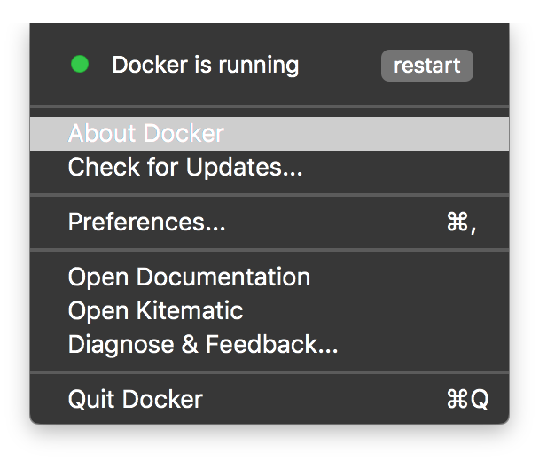
***Figure 15-1.** Docker macOS client in the menu bar needs to show "running"*

On the contrary, if you see a message like the one below, then daemon is running and you are ready to work with Docker!

```
Unable to find image 'hello-world:latest' locally
latest: Pulling from library/hello-world

c04b14da8d14: Pull complete
Digest: sha256:0256e8a36e2070f7bf2d0b0763dbabdd67798512411de4cdcf9431a1feb60fd9
Status: Downloaded newer image for hello-world:latest

Hello from Docker!
This message shows that your installation appears to be working correctly.


To generate this message, Docker took the following steps:
...
```

## Getting the AWS account


You can easily get a free (trial) AWS account. You'll need a valid email and a credit card. Read about the free tier at <https://aws.amazon.com/free/> and when you are ready, sign up by clicking on "CREATE A FREE ACCOUNT".


Once you are in, make sure you can access EC2 dashboard. Sometimes AWS requires a phone call or a waiting period. Most people can get an account within 10 minutes. It's not always easy to navigate your way around the AWS web console especially if you are a first time user. EC2 is just one of many, many, many AWS services. EC2 belongs to the Compute family or category while there are database, security, tools, networking and various other categories. 

Take a look at Figure 15-2 where I point to the location of the EC2 services in "Recently visited services". Right below that is the "Compute" category which also give you the access to the EC2 dashboard.

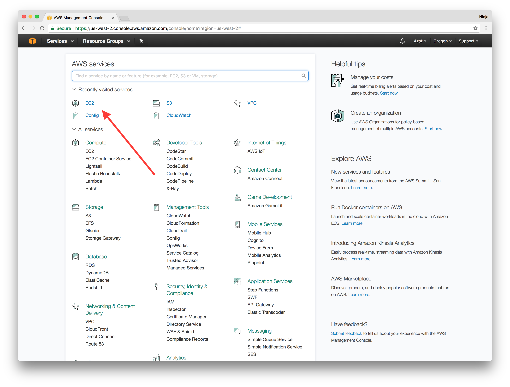
***Figure 15-2.** AWS web console has Compute and EC2, which we need for microservices and containers, in the top left column*

Using the web console is easy but it is limited when it comes to deployment of Docker containers and their images to the AWS container registry. (AWS web console is also limited in the fact that it's hard or even impossible to automate the web interface while it's very easy to automate the command-line interface by writing a few shell scripts.) AWS CLI will allow us to upload images to the cloud. We can later deploy those images from this cloud registry. Thus, we proceed to install the AWS CLI.

## Installing AWS CLI

Check for Python. Make sure you have 2.6+ or 3.6+. You can use pip (Python package manager) to install AWS CLI.

```bash
phyton --version
pip --version
pip install awscli
```

AWS CLI installation command for El Capitan users:

```bash
sudo -H pip install awscli --upgrade --ignore-installed six
```

Python at least 2.6.5 or 3.x (recommended), see here: <http://docs.aws.amazon.com/cli/latest/userguide/cli-chap-welcome.html>. At <https://www.python.org/downloads/> you can download Python for your OS.


There are a few other AWS CLI Installation options:

* [Install the AWS CLI with Homebrew](http://docs.aws.amazon.com/cli/latest/userguide/cli-install-macos.html#awscli-install-osx-homebrew) - for macOS
* [Install the AWS CLI Using the Bundled Installer (Linux, macOS, or Unix)](http://docs.aws.amazon.com/cli/latest/userguide/awscli-install-bundle.html) - just download, unzip and execute

You might be wondering how to verify AWS CLI installation. Run the following command to verify AWS CLI installation and its version (1+ is ok):

```bash
aws --version
```

# Dockerizing Node Microservice

Before deploying anything in the cloud let's build Node app Docker images locally. Then run container in development and production modes locally as well. When you finish this project, you will get 🍍.


## 1. Creating/Copying the Node Project

Firstly, you need to have the application code itself before you can containerize anything. Of course, you can copy the existing code from code/banking-api but it's better for learning to create the project from scratch.

This is what we will do now. Create a new project folder somewhere on your local computer:


```sh
mkdir banking-api
cd banking-api
mkdir api
cd api
```

Create vanilla/default package.json and install required packages as regular dependencies with exact versions:

```sh
npm init -y
npm i express@4.15.2 errorhandler@1.5.0 express@4.15.2 globalog@1.0.0 monk@4.0.0 pm2@2.4.6 -SE
```


Add the following npm scripts. First to test and the second to run the server using local pm2:

```js
  "scripts": {
    "test": "sh ./test.sh",
    "start": "if [[ ${NODE_ENV} = production ]]; then ./node_modules/.bin/pm2-docker start -i 0 server.js; else ./node_modules/.bin/pm2-dev server.js; fi"
  },
```

There are two CLI commands for pm2: `pm2-docker` for the container and `pm2-dev` for local development.

The full relative path `./node_modules/.bin` is recommended to make your command more robust. Local installation can be replaced with a global with `npm i -g pm2`. However, global installation is an extra step outside of package.json and `npm i` command and won't allow developers to use different versions of pm2 on one machine.


The source code for the Node+Express API (`code/ch15/banking-api/api/server.js`) is as follows:

```js
require('globalog')
const http = require('http')
const express = require('express')
const errorhandler = require('errorhandler')
const app = express()
const monk = require('monk')

const db = monk(process.env.DB_URI, (err)=>{
  if (err) {
    error(err)
    process.exit(1)
  }
})

const accounts = db.get('accounts')

app.use(express.static('public'))
app.use(errorhandler())

app.get('/accounts', (req, res, next)=>{
  accounts.find({ }, (err, docs) =>{
    if (err) return next(err)
    return res.send(docs)
  })
})

app.get('/accounts/:accountId/transactions', (req, res)=>{
  accounts.findOne({_id: req.params.accountId}, (err, doc) =>{
    if (err) return next(err)
    return res.send(doc.transactions)
  })
})

http.createServer(app).listen(process.env.PORT, ()=>{
  log(`Listening on port ${process.env.PORT}`)
})

```

The key here is that we are using two environment variables: PORT and DB_URI. We would need to provide them in Dockerfile or in command-line so the app has them set during running.

Let's verify your application works without Docker by starting MondoGB and the app itself.

```
mongod
```

In a new terminal:

```
DB_URI=mongodb://localhost:27017/db-dev PORT=3000 npm start
```

Yet, in another terminal:

```
curl http://localhost:3000/accounts
```

The result will be `[]%` because it's an empty database and accounts collection. If you use MongoUI or mongo shell to insert a document to db-dev database and accounts collections, then you'll see that document in the response.

The app is working and now is the time to containerize it.

## 2. Creating Dockerfile

Go back to banking-api and create an empty Dockerfile which must be exactly `Dockerfile`- no extension and starts with capital letter D:

```
cd ..
touch Dockerfile
```

Then, write in banking-api/Dockerfile the base image which is Node v6 based on Alpine which is basically a lightweight Ubuntu (which is Linux):

```sh
FROM node:6-alpine

# Some image metadata
LABEL version="1.0"
LABEL description="This is an example of a Node API server with connection to MongoDB. \
More details at https://github.com/azat-co/node-in-production and https://node.university"
#ARG mongodb_container_name
#ARG app_env

# Environment variables
# Add/change/overwrite with docker run --env key=value
# ENV NODE_ENV=$app_env
ENV PORT=3000
# ENV DB_URI="mongodb://${mongodb_container_name}:27017/db-${app_env}"
# agr->env->npm start->pm2-dev or pm2-docker
# User
#USER app
# Mount Volume in docker run command

# RUN npm i -g pm2@2.4.6

# Create api directory
RUN mkdir -p /usr/src/api
# From now one we are working in /usr/src/api
WORKDIR /usr/src/api

# Install api dependencies
COPY ./api/package.json .
# Run build if necessary with devDependencies then clean them up
RUN npm i --production

# Copy keys from a secret URL, e.g., S3 bucket or GitHub Gist
# Example adds an image from a remote URL
ADD "https://process.filestackapi.com/ADNupMnWyR7kCWRvm76Laz/resize=height:60/https://www.filepicker.io/api/file/WYqKiG0xQQ65DBnss8nD" ./public/node-university-logo.png

# Copy API source code
COPY ./api/ .

EXPOSE 3000

# The following command will use NODE_ENV to run pm2-docker or pm2-dev
CMD ["npm", "start"]
```

Next we will learn what these statements mandate Docker to do.

Firstly, create app directory in the docker container. So the next "commands" in your Dockerfile will tell Docker to create a folder and the to set up a default folder for subsequent commands:

```
# Create api directory
RUN mkdir -p /usr/src/api
# From now one we are working in /usr/src/api
WORKDIR /usr/src/api
```

`COPY` will get the project manifest file `package.json` into the container. This allows to install app dependencies by executing `npm i`. Of course, let's skip the development dependencies and other junk with `--production` (devDependencies could be Webpack, Babel, JSLint, etc.).

```
# Install api dependencies
COPY ./api/package.json .
# Run build if necessary with devDependencies then clean them up
RUN npm i --production
```

Next, bundle app source by using `COPY` which will take files from the current folder on host (using the dot `.`) and put them into `api` folder in the container. Remember, container folder is first and the host is the second.

```
# Copy API source code
COPY ./api/ .
```

You want to open port cause otherwise no incoming connections will ever get to the container (outgoing are fine implicitly), and start the server with `CMD` which runs `npm start`.

```
EXPOSE 3000
CMD [ "npm", "start" ]
```

By now the Dockerfile, which is a blueprint for your Node microservice, is ready. The code for the microservice is ready too. It's REST API with Express.

Next, building, running and verifying the container.

Build the image from the banking-api folder where you should have Dockerfile and the `api` folder:

```
docker build .
```

Ah. Don't forget to start the Docker Engine before building. Ideally, you would see 13 steps such as:

```
docker build .
Sending build context to Docker daemon 23.82 MB
Step 1/13 : FROM node:6-alpine
6-alpine: Pulling from library/node
79650cf9cc01: Pull complete
db515f170158: Pull complete
e4c29f5994c9: Pull complete
Digest: sha256:f57cdd2969122bcb9631e02e632123235008245df8ea26fe6dde02f11609ec57
Status: Downloaded newer image for node:6-alpine
 ---> db1550a2d1e5
Step 2/13 : LABEL version "1.0"
 ---> Running in 769ba6574e60
 ---> 63d5f68d2d01
Removing intermediate container 769ba6574e60
Step 3/13 : LABEL description "This is an example of a Node API server with connection to MongoDB. More details at https://github.com/azat-co/node-in-production and https://node.university"
 ---> Running in f7dcb5dd35b6
 ---> 08f1211cbfe1

 ...

Step 13/13 : CMD npm start
 ---> Running in defd2b5776f0
 ---> 330df9053088
Removing intermediate container defd2b5776f0
Successfully built 330df9053088
```

Each step has a hash. Copy the last hash of the image, e.g., 330df9053088 in my case.

As an interim step, we can verify our image by using a host database. In other words, our app will be connecting to the host database from a container. This is good for development. In production, you'll be using managed database such as AWS RDS or Compose or mLabs or a database in a separate (second) container.

To connect to your local mongo instance (must be running) let's grab your host IP:

```
ifconfig | grep inet
```

Look for the one that says `inet`, e.g., 	`inet 10.0.1.7 netmask 0xffffff00 broadcast 10.0.1.255` means my IP is 10.0.1.7.

Put the IP in the environment variable in the run command for the Docker build of the app image. In other words, substitute the {host-ip} and {app-image-id} with your values:


```
docker run --rm -t --name banking-api -e NODE_ENV=development -e DB_URI="mongodb://{host-ip}:27017/db-prod" -v $(pwd)/api:/usr/src/api -p 80:3000 {app-image-id}
```

This command has IP and my image ID in the command instead of `{}` values. Don't copy my command as-is but put your IP and image ID though.

```
docker run --rm -t --name banking-api -e NODE_ENV=development -e DB_URI="mongodb://10.0.1.7:27017/db-prod" -v $(pwd)/api:/usr/src/api -p 80:3000 330df9053088
```

Each option is important. `-e` passes environment variables, `-p` maps host 80 to container 3000 (set in Dockerfile), `-v` mounts the local volume so you can change the files on the host and container app will pick up the changes automatically!

Go ahead and verify by using `curl localhost/accounts`. Then, modify your `server.js` without re-building or stopping the container. You can add some text, a route or mock data to the `/accounts`:

```js
app.get('/accounts', (req, res, next)=>{
  accounts.find({ }, (err, docs) =>{
    if (err) return next(err)
    docs.push({a:1})
    return res.send(docs)
  })
})
```

Hit save in your editor on your host and boom! You'll see the change in the response from the app container. The change is the `a:1` response instead of the empty response `[]` as before. This means that the code *in the container* is changing because of the volume and the changes *in the host*. See what I have here as the CURL request and microservice's response:

```
curl localhost/accounts
[{"a":1}]%
```

To stop the container, simply run the `stop` command with the container name which you specified when you run the `docker run` command. Here's the stop command for the `banking-api` name:

```
docker stop banking-api
```

Or get the container ID first with `docker ps` and then run `docker stop {container-id}`.

The bottom line is that our Dockerfile is production-ready but we can run the container in dev mode (NODE_ENV=development) with volumes and host database which allows us to avoid any modifications between images and/or Dockerfiles when we go from dev to prod.

# Use Docker Networks for Multi-container Setup

Microservices are never used alone. They need to communicate with other micro and normal services.

As mentioned, Dockerfile you created is ready to be deployed to cloud without modifications. However, if you want to run MongoDB or any other service in a container (instead of a host or managed solution like mLab or Compose), then you can do it with Docker networks. The idea is to create a network and launch two (or more) containers inside of this network. Every container in a network can "talk" to each other just by name.

## Creating a Docker Network

Assuming you want to name your network `banking-api-network`, run this command:

```
docker network create --driver=bridge banking-api-network
```

Verify by getting `banking-api-network` details or list of all networks:

```
docker network inspect banking-api-network
docker network ls
```

You would see a table with network ID, driver (bridge, or host), name, etc. like this:

```
docker network ls
NETWORK ID          NAME                  DRIVER              SCOPE
e9f653fffa25        banking-api-network   bridge              local
cd768d87acb1        bridge                bridge              local
0cd7db8df819        host                  host                local
8f4db39bd202        none                  null                local
```

Next, launch vanilla mongo image in `banking-api-network` (or whatever name you used for your network). The name of the container `mongod-banking-api-prod-container` will become the host name to access it from our app:

```
docker run --rm -it --net=banking-api-network --name mongod-banking-api-prod-container mongo
```

Note: If you didn't have mongo image, Docker will download it for you. It'll happen just once, the first time.

Leave this mongo running. Open a new terminal.

## Launch App into a Network

This is my command to launch my Node app in a production mode and connect to my mongo container which is in the same network (`banking-api-network`):

```
docker run --rm -t --net=banking-api-network --name banking-api -e NODE_ENV=production -e DB_URI="mongodb://mongod-banking-api-prod-container:27017/db-prod" -p 80:3000 330df9053088
```

The `330df9053088` must be replaced with your app image ID from the previous step when you did `docker build .`. If you forgot the app image ID, then run `docker images` and look up the ID.

This time, you'll see `pm2` in a production clustered mode. I have 2 CPUs in my Docker engine settings, hence `pm2-docker` spawned two Node processes which both listen for incoming connections at 3000 (container, 80 on the host):

```
docker run --rm -t --net=banking-api-network --name banking-api -e NODE_ENV=production -e DB_URI="mongodb://mongod-banking-api-prod-container:27017/db-prod" -p 80:3000 330df9053088
npm info it worked if it ends with ok
npm info using npm@3.10.10
npm info using node@v6.10.3
npm info lifecycle banking-api@1.0.0~prestart: banking-api@1.0.0
npm info lifecycle banking-api@1.0.0~start: banking-api@1.0.0

> banking-api@1.0.0 start /usr/src/api
> if [[ ${NODE_ENV} = production ]]; then ./node_modules/.bin/pm2-docker start -i 0 server.js; else ./node_modules/.bin/pm2-dev server.js; fi

[STREAMING] Now streaming realtime logs for [all] processes
0|server   | Listening on port 3000
1|server   | Listening on port 3000
```

The command is different than in the previous section but the image is the same. The command does NOT have volume and has different environment variables. There's no need to use a volume since we want to bake the code into an image for portability.

Again, open a new terminal (or use an existing tab) and run CURL:

```
curl http://localhost/accounts
```

If you see `[]%`, then all is good.

Inspecting your network with `docker network inspect banking-api-network` will show you have 2 running containers there:

```js
...
      "Containers": {
          "02ff9bb083484a0fe2abb63ec79e0a78f9cac0d31440374f9bb2ee8995930414": {
              "Name": "mongod-banking-api-prod-container",
              "EndpointID": "0fa2612ebc14ed7af097f7287e013802e844005fe66a979dfe6cfb1c08336080",
              "MacAddress": "02:42:ac:12:00:02",
              "IPv4Address": "172.18.0.2/16",
              "IPv6Address": ""
          },
          "3836f4042c5d3b16a565b1f68eb5690e062e5472a09caf563bc9f11efd9ab167": {
              "Name": "banking-api",
              "EndpointID": "d6ae871a94553dab1fcd6660185be4029a28c80c893ef1450df8cad20add583e",
              "MacAddress": "02:42:ac:12:00:03",
              "IPv4Address": "172.18.0.3/16",
              "IPv6Address": ""
          }
      },
  ...
```

Using the similar approach, you can launch other apps and services into the same network and they'll be able to talk with each other.

Note: The older `--link` flag/option is deprecated. Don't use it. See <https://docs.docker.com/engine/userguide/networking/default_network/dockerlinks>

Let me share some of the common issues and their solutions for easy and effortless troubleshooting. Here's the top list:

* No response: Check that the port is mapped in the `docker run` command with `-p`. It's not enough to just have `EXPOSE` in Dockerfile. Developers need to have both.
* The server hasn't updated after my code change: Make sure you mount a volume with `-v`. You don't want to do it for production though.
* I cannot get my IP because your command is not working on my Windows, Linux, ChromeOS, etc., see <http://www.howtofindmyipaddress.com>
* I can't understand networks. I need more info on networks. See <https://blog.csainty.com/2016/07/connecting-docker-containers.html>

# Node Containers in AWS with EC2 ECS

For the next topics, we will learn how to deploy Node microservices into cloud. ☁️ When you are done, write me a post card and send it with a pigeon.

The goal is to deploy two containers (API and DB) which connect using ECR and EC2 ECS is achieved with the following steps:

1. Creating AWS Elastic Cloud Registry (ECR) to store images in the cloud
1. Uploading the app image to the cloud (using ECR)
1. Creating a new ECS task definition with 2 containers to connect them
1. Creating a container cluster (using ECS)
1. Creating a container service and running it in the cloud (using ECS)

## 1. Creating Registry (ECR)

Each image needs to be uploaded to a registry before we can use it to run a container. There is registry from docker: hub.docker.com. AWS provides its own registry service called EC2 Elastic Container Registry (ECR). Let's use it.

Log in to your AWS web console at aws.amazon.com. Navigate to us-west-2 (or some other region, but we are using us-west-2 in this lab) and click on CE2 Container Service under Compute as shown in the Figure 15-3.

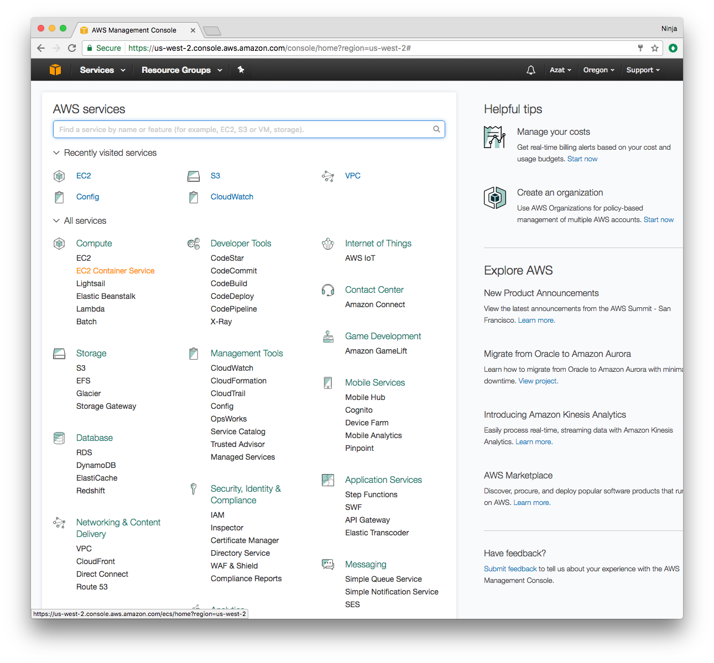
***Figure 15-3.** Selecting EC2 Container Service under Compute from the AWS web console*

Then click on Repositories from a lift menu and on a blue button *Create repository*. Then new repository wizard will look like my screenshot on Figure 15-4.


***Figure 15-4.** Configure repository (step 1 of creating ECR) which prompts for the container repository name*

Enter the name of your repository for container images. I picked azat-main-repo because my name is Azat as depicted on Figure 15-5. Do the same. Not in the sense of picking the same name but in the sense of naming your repository with some name which you can remember to use later.

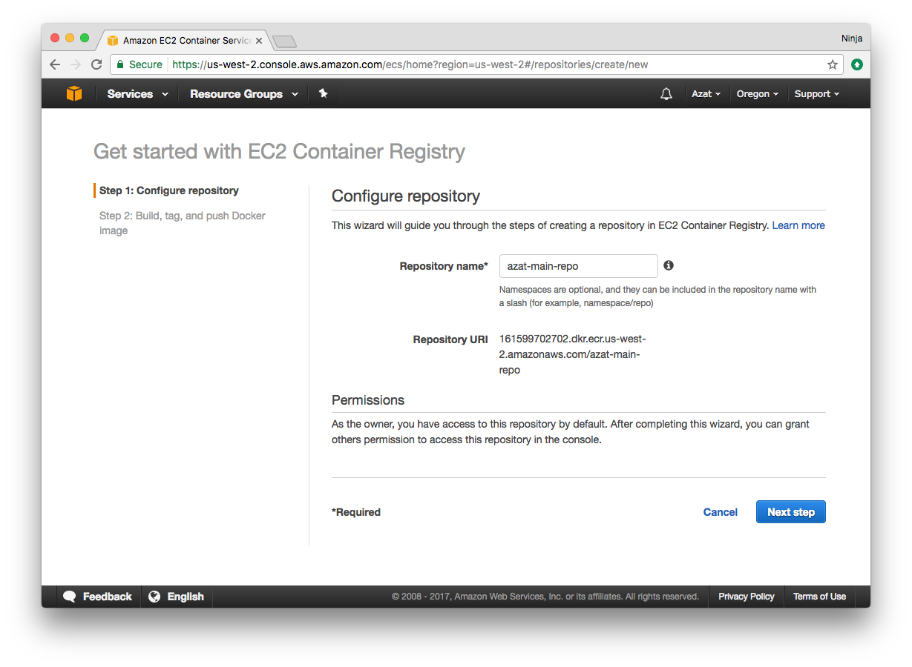
***Figure 15-5.** Entering the name of the ECR as "azat-main-repo" (for example)*

Click next and on Step 2, you will see bunch of commands (Figure 15-6). Write them down and put somewhere safe... away from a dog so it can't eat it.


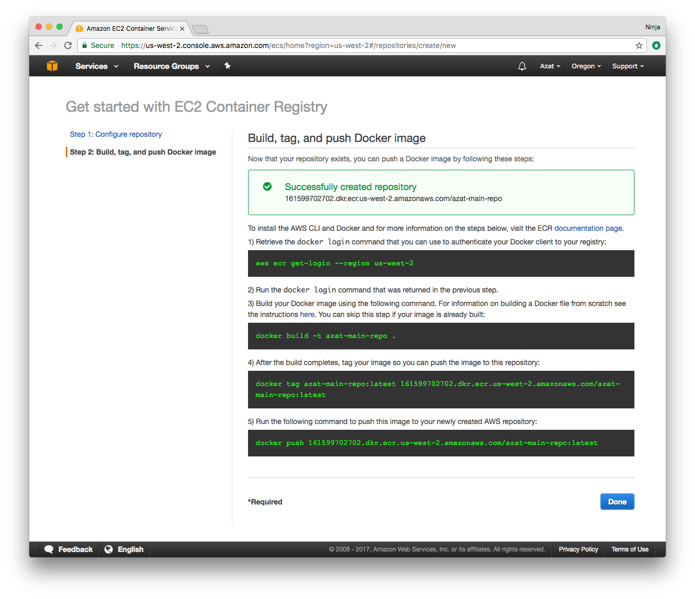
***Figure 15-6.** Building and pushing instructions (step 2 of creating ECR) which explains how to upload Docker images*

Successfully created repository, e.g., my URL is:

```
161599702702.dkr.ecr.us-west-2.amazonaws.com/azat-main-repo
```

Next, follow instructions to upload an image (must build it before uploading/pushing).

To install the AWS CLI and Docker, and for more information on the steps below, [visit the ECR documentation page](http://docs.aws.amazon.com/AmazonECR/latest/userguide/ECR_GetStarted.html).

**Command 1:** Retrieve the docker login command that you can use to authenticate your Docker client to your registry:

```
aws ecr get-login --region us-west-2
```


**Command 2:** Run the docker login command that was returned in the previous step. For example,

```
docker login -u AWS -p eyJwYXlsb2FkIjoiQ1pUVnBTSHp
FNE5OSU1IdDhxeEZ3MlNrVTJGMUdBRlAxL1k4MDhRbE5lZ3JUW
...
W5VK01Ja0xQVnFSN3JpaHCJ0eXBlIjoiREFUQV9LRVkifQ==
-e none https://161599702702.dkr.ecr.us-west-2.amazonaws.com
```

Results:

```
Login Succeeded
```

**Command 3:**: Build your Docker image using the following command. For information on building a Docker file from scratch see the instructions here. You can skip this step if your image is already built:

```
cd code/banking-api
docker build -t azat-main-repo .
```

You might have done this already in the lab 1 (labs/1-dockerized-node.md). Skip to step 4. If not, then build the app image. The build command should end with a similar looking output:

```
...
Step 13/13 : CMD npm start
> Running in ee5f0fb12a2f
> 91e9122e9bed
Removing intermediate container ee5f0fb12a2f
Successfully built 91e9122e9bed
```


**Command 4:** After the build completes, tag your image so you can push the image to this repository:

```
docker tag azat-main-repo:latest 161599702702.dkr.ecr.us-west-2.amazonaws.com/azat-main-repo:latest
```

(No output)


**Command 5:** Run the following command to push this image to your newly created AWS repository:

```
docker push 161599702702.dkr.ecr.us-west-2.amazonaws.com/azat-main-repo:latest
```


Push output example:

```
The push refers to a repository [161599702702.dkr.ecr.us-west-2.amazonaws.com/azat-main-repo]
9e5134c1ad7a: Pushed
e949bf24b1c4: Pushed
2b5c968a7072: Pushed
858e5e857851: Pushed
10e038bbd0ad: Pushed
ad2f0f4f7c5a: Pushed
ec6eb0ab894f: Pushed
e0380bb6c0bb: Pushed
9f8566ee5135: Pushed
latest: digest: sha256:6d1cd529ced84a6cff1eb5f6cffaed375717022b998e70b0d33c86db26a04c74 size: 2201
```

Remember digest (last hash) 📝 Compare digest with one in the repository when you look up your image in the web console in EC2 -> ECS -> Repositories -> azat-main-repo as demonstrated in Figure 15-7.


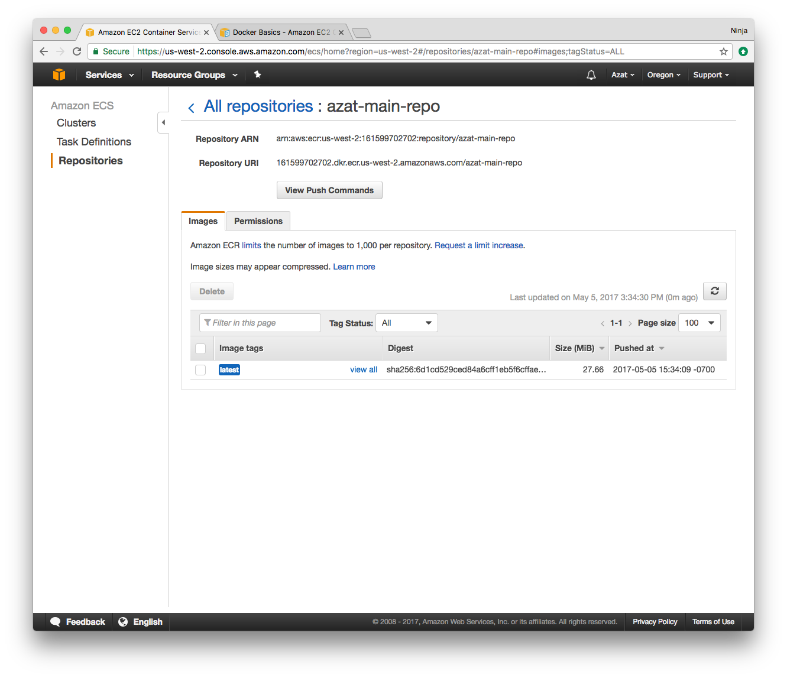
***Figure 15-7.** The image uploaded to the newly created container repository is listed with the correct digest and timestamp*


The image's in the cloud and now is the time to set up a certain mechanism to run this image.

## 2. Create a New Task Definition

Tasks are like run commands in docker CLI (`docker run`) but for multiple containers. Typical tasks define:

* Container images to use
* Volumes if any
* Networks
* Environment variables
* Port mappings

Go to the Task Definitions in EC2 ECS and as you might guess, press on the button which says *Create new Task Definition* as it does in Figure 15-8.

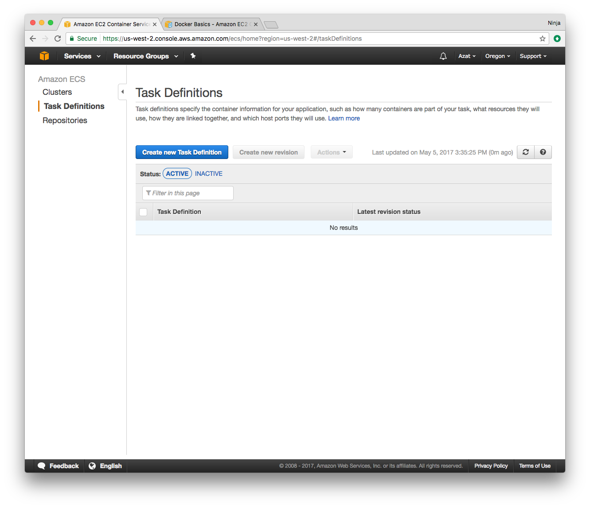
***Figure 15-8.** Creating a new task definition is easily done from the Task Definitions screen*

### Defining the Main Task Settings for the Example

Use the following settings for the task to make sure your project is running (because some other values might make the project nonfunctional):

* Two containers: `banking-api` (private AWS ECR) and `mongodb` (docker hub)
* Connect to mongodb via network alias
* Map 80 (host) to 3000 (container) for banking-api
* Set env vars for `NODE_ENV` and `DB_URI`

Let's define the first container — app.

### Defining the First Container: App

Enter the name: banking-api-container.

Define the image URL (your URL will be different), e.g.,

```
161599702702.dkr.ecr.us-west-2.amazonaws.com/azat-main-repo:latest
```

Define host 80 and container 3000 ports in port mappings. Name, image and ports are shown below in Figure 15-9. The values are `banking-api-container`, `161599702702.dkr.ecr.us-west-2.amazonaws.com/azat-main-repo:latest` and `80:3000` respectively.


***Figure 15-9.** The correct API container configurations have name, image ID and port values.*

Scroll down in the same modal view and add Env Variables:

```
DB_URI=mongodb://mongod-banking-api-prod-container:27017/db-prod
NODE_ENV=production
```

Add to Links the name of the MongoDB container (not defined yet) to give access to the database container to the app container such as one is the name of the container in the task definition and the other is the host name in the DB_URI:

```
mongod-banking-api-prod-container:mongod-banking-api-prod-container
```

A picture's worth a thousand words. Ergo, see the screengrab below on Figure 15-10 which shows the correct values for the environment variables and the Network settings to link the database to the API.

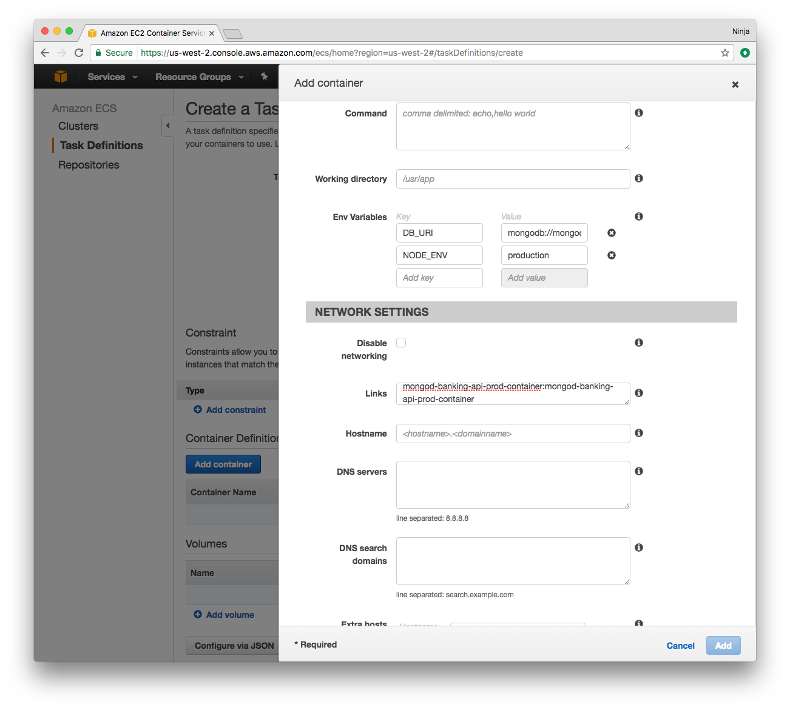
***Figure 15-10.** Environment variables and network settings for the API container*


That's it for the API container. Next we will deal with the database container settings which we must define *in the same task definition* as the API container.

### Defining the Second Container: Database

Analogous to the previous container (API), define name and URL with these values for the DB container (Figure 15-11):

* Name: mongod-banking-api-prod-container
* Image URL: registry.hub.docker.com/library/mongo:latest

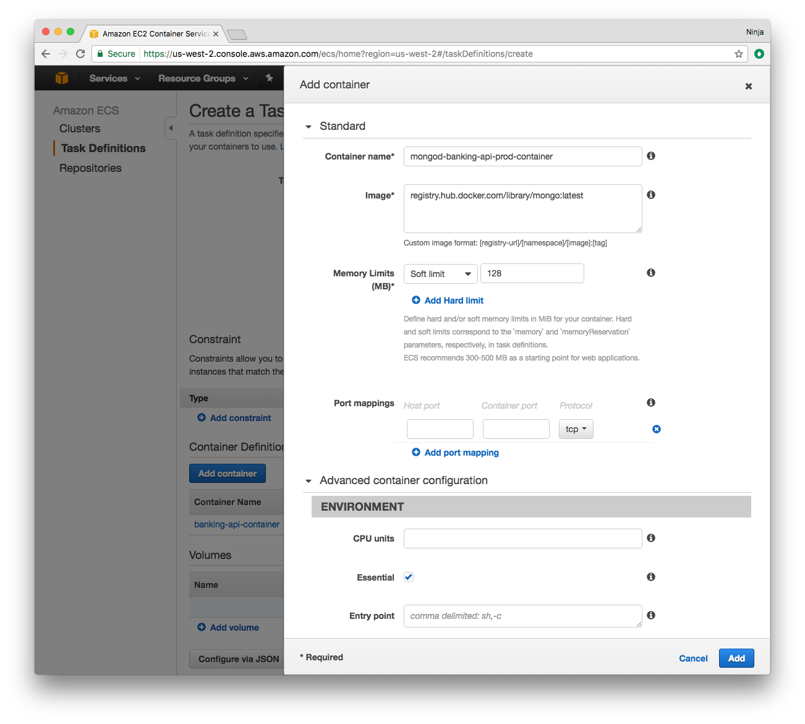
***Figure 15-11.** Database container settings have name and image URL*

Next piece is very important because it allows API to connect to this database container so pay attention closely. Scroll down to the hostname in the Network settings and enter Hostname as `mongod-banking-api-prod-container` as shown below in Figure 15-12.

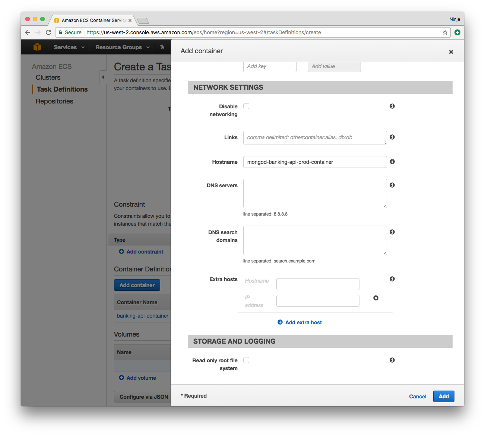
***Figure 15-12.** Defining hostname as mongo-banking-api-prod-container for the database container*

After this hostname, We are done with the database container settings. Since you've added two container to the task, everything is ready to create the task. Do it and you'll see a screen similar to the one shown below in Figure 15-13.

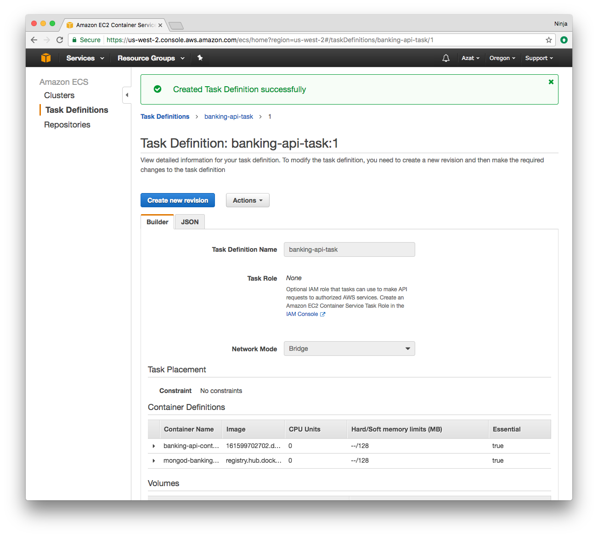
***Figure 15-13.** The newly created task shows two containers and their respective image IDs correctly*

Alternatively, you could specify volumes for database or/and the app at the stage of the task creation. But I will leave it for the next book. Send me a note if you're interested in this topic.


## 3. Creating Cluster

Cluster is the place where AWS runs containers. They use configurations similar to EC2 instances (Figure 15-14). Define the following:

* Cluster name: `banking-api-cluster`
* EC2 instance type: m4.large (for more info on EC2 type, see [AWS Intro course on Node University](https://node.university/p/aws-intro))
* Number of instances: 1
* EBS storage: 22
* Key pair: None
* VPC: New

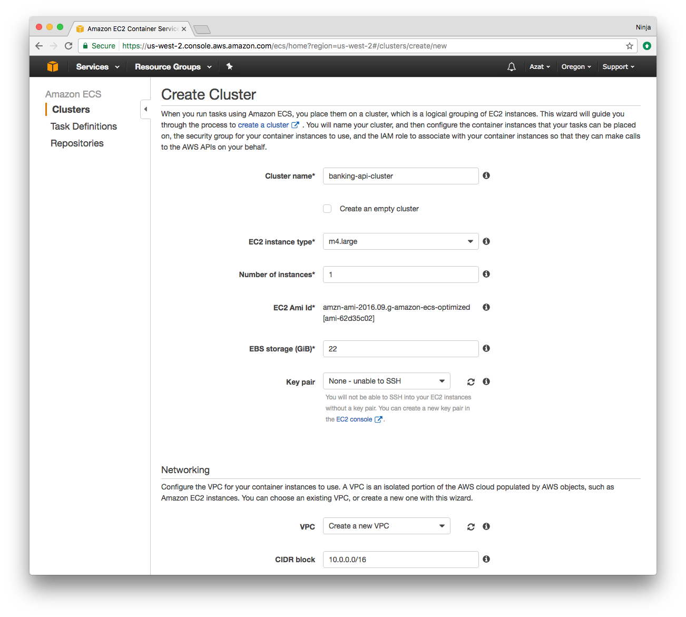
***Figure 15-14.** Creating cluster page which has settings not unlike settings of an EC2 instance*

Launch the cluster. It might take a few minutes (Figure 15-15 and Figure 15-16).

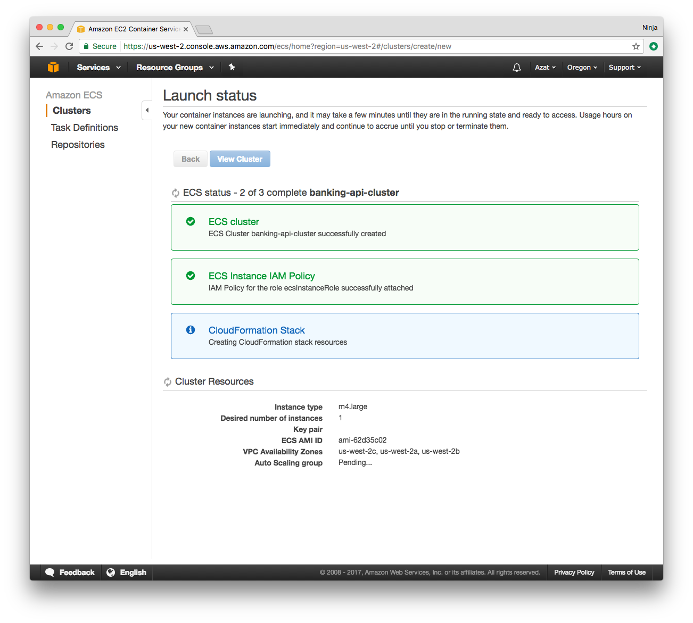
***Figure 15-15.** Creating cluster has three steps: cluster, IAM policy and CF stack resources*

You'll see the progress as shown in Figure 15-5. Under the hood, AWS uses AWS CloudFormation which is a declarative way to create not just single resources such as Virtual Private Clouds or EC2 instances but whole stacks of dozens or more of such resources. CF is like an aircraft career. Later, you'll start seeing these resources as I captured in Figure 15-16. All of them will enable the smooth running and functioning of your containers. If you want to learn more about AWS and Node, read [my free blog tutorials](https://node.university/blog) on Node University and take [some of my AWS courses there](https://node.university/courses/category/Cloud). 

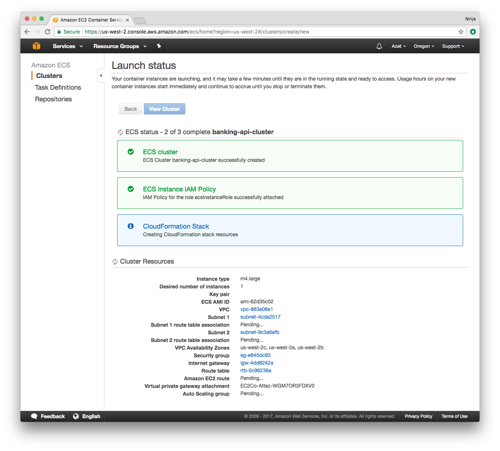
***Figure 15-16.** Creating cluster involves creating multiple AWS resources: VPC, security group, routes, subnets, autoscaling groups, etc.*

Finally, you'll see that the cluster is ready (Figure 15-17) after ECS created a lot of EC2 resources for you such as Internet Gateway, VPC, security group, Auto Scaling group, etc. which is great because you don't have to create them manually. The cluster is ready in its own VPC with a subnet 1 and 2. In my example on Figure 15-17, you can see Availability Zones (AZs) us-west-2c, us-west-2a and us-west-2b. That's good because in case something happens in one AZ (it's like a data center), we will have the ability to launch or use another AZ.

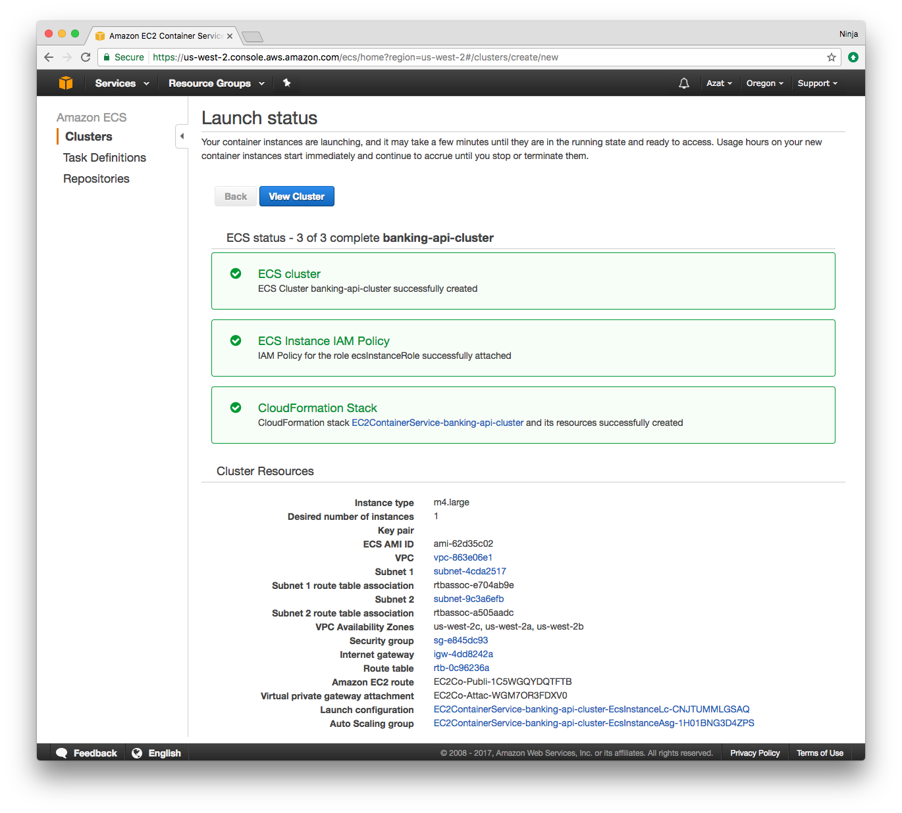
***Figure 15-17.** Creating cluster involves creating multiple AWS resources: VPC, security group, routes, subnets, autoscaling groups, etc.*

We uploaded images, created task definition and launched the cluster. However, if you are thinking we are done you are mistaken. The next step is to create a service.

## 4. Creating Cloud Container Service and Verifying it

The last step is to create a service which will take the task and the cluster and make the containers in the task run in the specified cluster. It's oversimplified explanation because service will do more such as monitor health and restart containers.

Go to Create Services which is under Task Definition -> banking-api-task -> Actions -> Create Service. You will see this that our Elastic Container Service service (ESC service has a double "service"?) is ready because it's been created as shown in my screenshot on Figure 15-18.

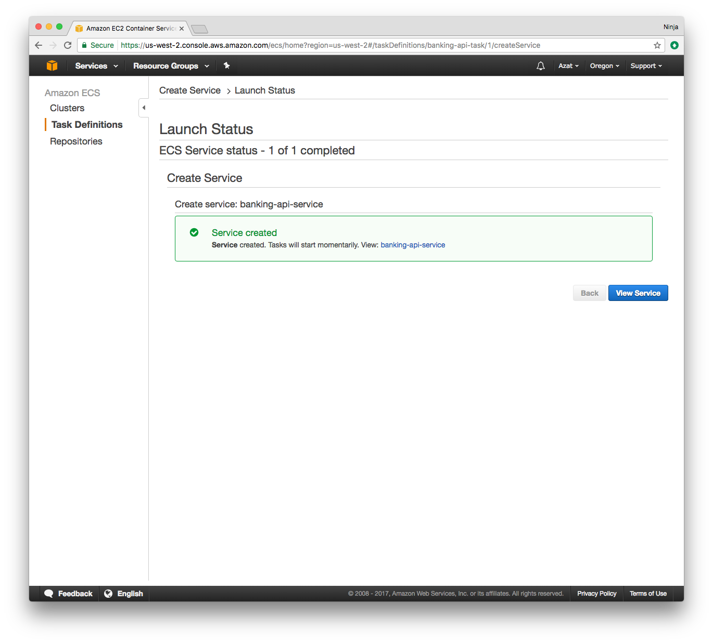
***Figure 15-18.** ECS service banking-api-service is ready*

Phew. 😅 Everything should be ready by now. The containers should be RUNNING. To verify it, we need to grab a public IP or public DNS. To do so, click Clusters -> banking-api-cluster (cluster name) -> ESC Instances (tab) and Container instance as illustrated in Figure 15-19 which shows the running container instance with the corresponding Public DNS and Public IP. We need those. Either one of them. 

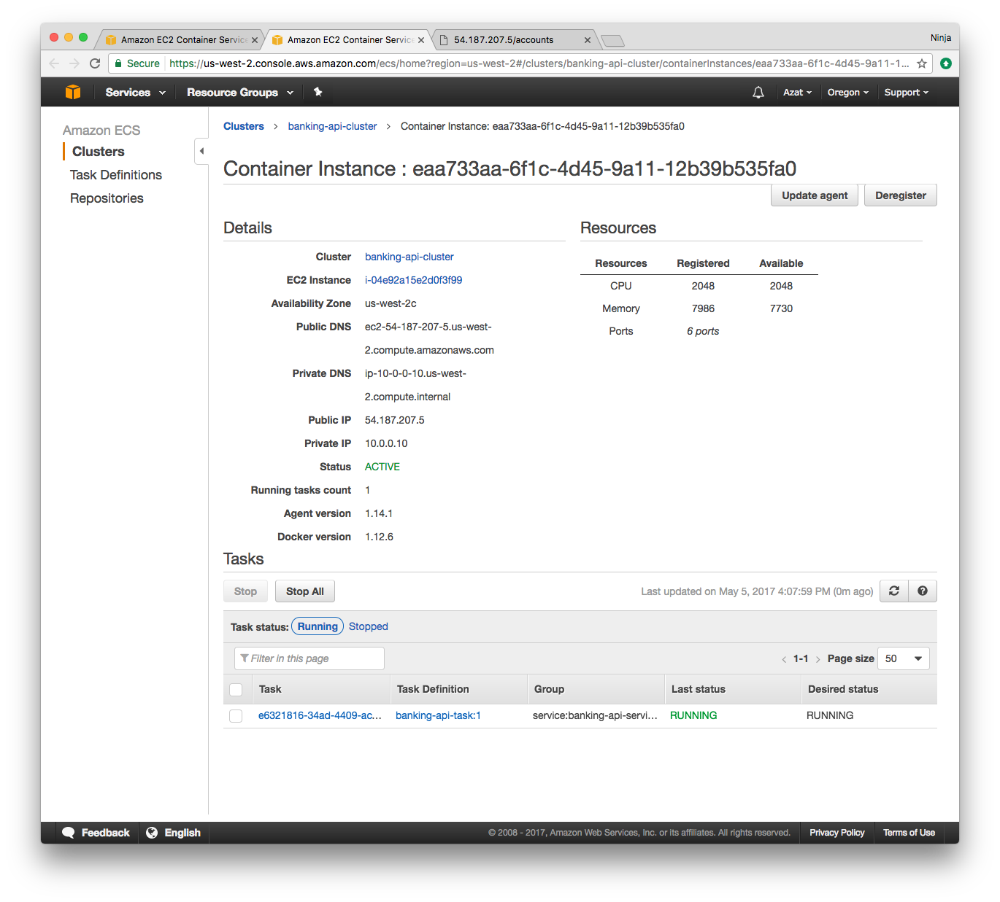
***Figure 15-19.** Container instance under cluster shows public IP and DNS name*

Copy public IP or DNS 📝 for that cluster (which is like an EC2 instance). We will need it for testing.

First, we need a dynamic content test. That's the Node API and MongoDB. To test the dynamic content (content generated by the app with the help of a database), open in browser with `{PUBLIC_DNS}/accounts`. Most likely the response will be `[]` because the database is empty but that's a good response. The server is working and can connect to the database from a different container.


Next, we need a static content test which is our static asset, i.e., image, inside of the container.

To test the static content such as an image which was downloaded from the Internet by Docker (ADD in Dockerfile) and baked into the image, navigate to http://{PUBLIC_DNS}/node-university-logo.png to see the images with Docker downloaded via `ADD`. Using ADD, you can fetch any data such as HTTPS certificates (from a private S3 for example).

## 5. Terminate Service and Cluster/Instances

Don't forget to terminate your service and instances. Otherwise you will be still paying dinero for running those could resources. (I am sure you can find a better way to spend the money. For example, buying some DOGECOIN.) You can terminate resources from the AWS web console. Do so for ECS first. Make sure you remove tasks. 

Summary
=======

Microservices is an old concepts when you think about it as decoupling and loose coupling. The less functionality you pack into an application, the more flexible and easier it will be to scale different parts of the app(s) or to maintain them (make changes). There are certain downsides of microservices as well. Uber engineers are crying because they have 2,500+ microservices with all the overhead involved in managing their environments, provisioning, patches and deployments. Luckily, containers and cloud services such as Docker and AWS ECS are here to help in reducing this complexity and management of microservices. 

In this chapter you've built your own microservices which connect to another service (MongoDB) both locally and in the cloud. You used Docker by the way of making an image. What's great about this dockerization is that your project is extremely portable. It's mostly independent of OS or any other discrepancies which often can bite a developer in a tail.