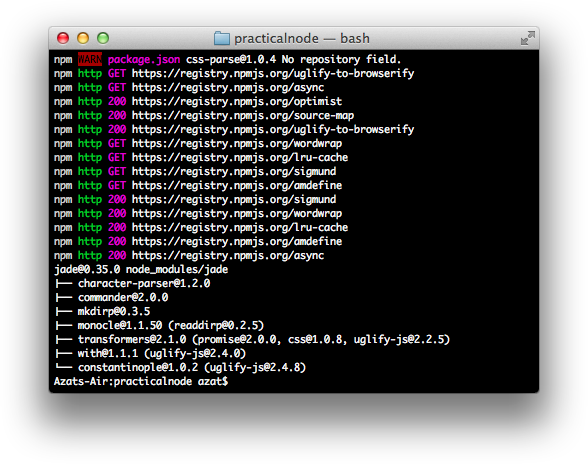
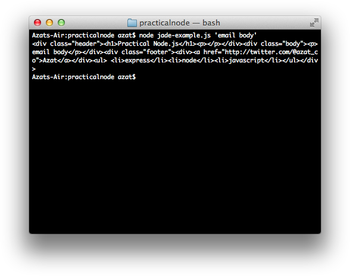
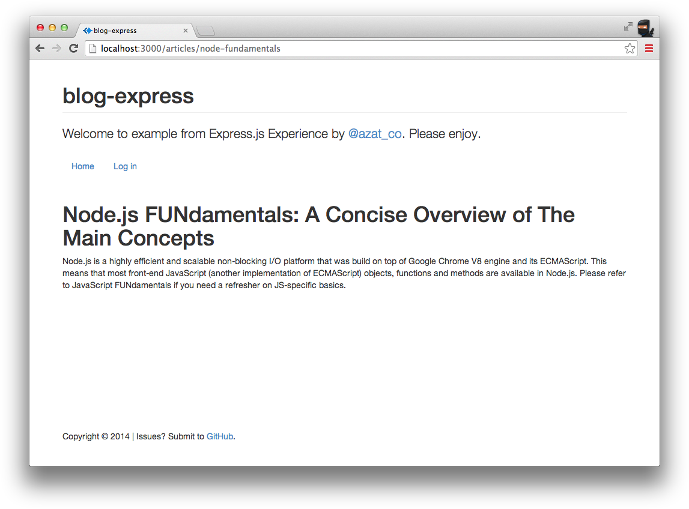
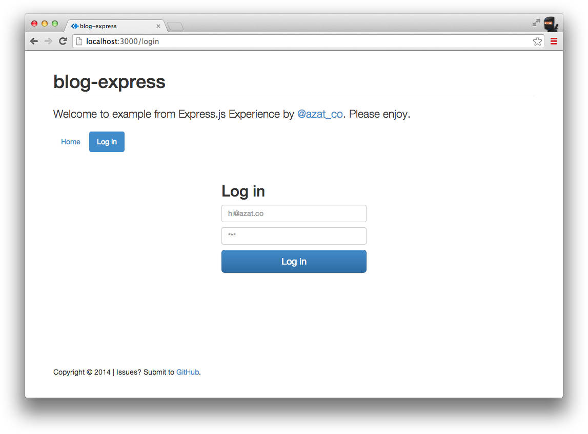
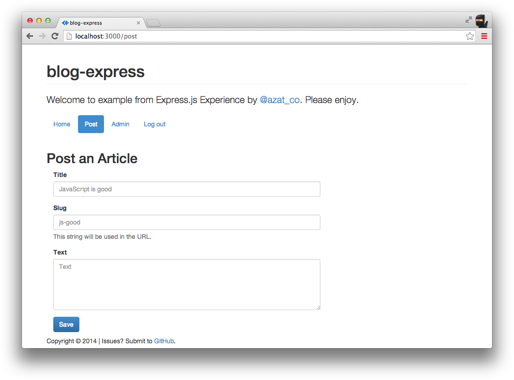
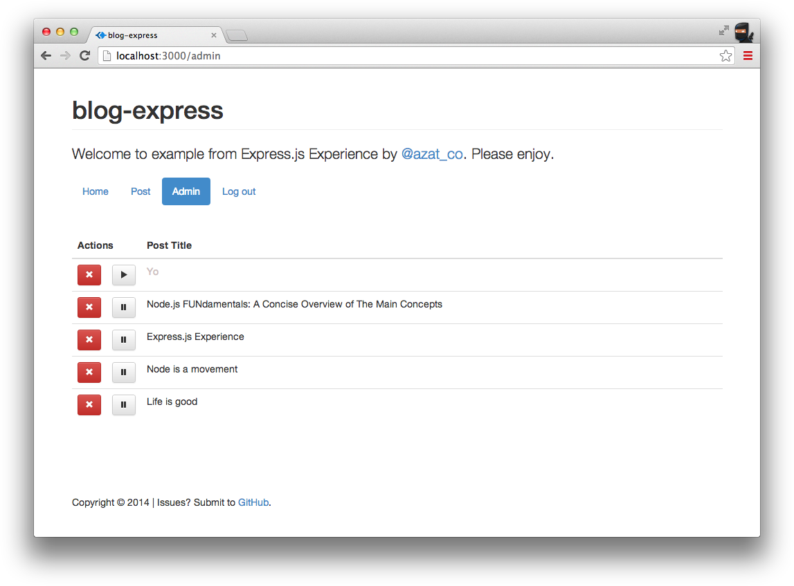

Chapter 4
---------
# Template Engines: Pug and Handlebars

A template engine is a library or a framework that uses some rules/languages to interpret data and render views. In the case of web applications, views are HTML pages (or parts of them), but they can be JSON or XML files, or, of desktop programs, GUIs. For those of you familiar with the model–view–controller concept, templates belong to the view.

In web apps, it&#39;s beneficial to use templates because we can generate an infinite number of pages dynamically with a single template! Another side benefit is when we need to change something; we can do it in one place only.

If we go back to the diagrams in the previous chapter (traditional vs. REST API approaches), we can deduce that templates can be compiled into HTML either server-side (traditional approach) or client-side (REST API approach). No matter which approach we take, the syntax of the libraries themselves remains intact.

In this chapter we cover the following:

- Pug syntax and features
- Pug standalone usage
- Handlebars syntax
- Handlebars standalone usage
- Pug and Handlebars usage in Express.js
- Project: adding Pug templates to Blog

# Pug Syntax and Features

Pug is a Node.js brother of Haml, in the sense that it uses whitespace and indentation as part of its language. Therefore, we need to be careful to follow the proper syntax.

You can follow the Pug syntax examples in this section online, at the official web site&#39;s demo page(<http://pug-lang.com/demo>) or at the @naltatis resource,(<http://naltatis.github.io/pug-syntax-docs>) or by writing standalone Node.js scripts (examples are presented in “Pug Standalone Usage,” which appears later in this chapter).

## Tags

Any text at the beginning of a line—by default—is interpreted as an HTML tag. The main advantage of Pug is that this text renders both closing and opening tags for the HTML element, as well as the `<></>` symbols. Therefore, we save many keystrokes as developers writing in Pug!

The text following a tag and a space (e.g., `tag <text>`) is parsed as the inner HTML (i.e., content inside the element). For example, if we have the following Pug code:

```pug
body
  div
    h1 Practical Node.js
    p The only book most people will ever need.
  div
    footer &copy; Apress
```

The output of the template above will be:

```pug
<body>
  <div>
    <h1> Practical Node.js </h1>
    <p> The only book most people will ever need. </p>
  </div>
  <div>
    <footer> &copy; Apress </footer>
  </div>
</body>
```

The code above is an HTML body. How about some more interesting HTML like the entire web page with head and other tags? Sure. Here's an example of how to define `DOCTYPE`, and element attributes such as `id` and `class`.

```pug
doctype html
html(lang="en")
  head
    title Why JavaScript is Awesome | CodingFear: programming and human circumstances
    script(type='text/javascript').
      const a = 1
      console.log(`Some JavaScript code here and the value of a is ${a}`)
  body
    h1 Why JavaScript is Awesome
    #container.col
        p You are amazing
        p Get on it!
      p.
        JavaScript is fun. Almost everything 
        can be written in JavaScript. It is huge.
```

THe output will contain attributes defined with parenthesis `(key=value)`, JavaScript code which will be executed when the page is viewed in the browsers and of course text which can start on a new line if you use a dot `.` after the element or parenthesis. The `#` means it's an id attribute while the dot in the element means a class attribute. And omitting the element name like we did with the `#container.col` will produce `<div>` with id `container` and class `col`.

```html
<!DOCTYPE html>
<html lang="en">
  <head>
    <title>Why JavaScript is Awesome | CodingFear: programming and human circumstances</title>
    <script type="text/javascript">
      const a = 1
      console.log(`Some JavaScript code here and the value of a is ${a}`)
    </script>
  </head>
  <body>
    <h1>Why JavaScript is Awesome</h1>
    <div class="col" id="container">
      <p>You are amazing</p>
      <p>Get on it!</p>
      <p>
        JavaScript is fun. Almost everything
        can be written in JavaScript. It is huge.
      </p>
    </div>
  </body>
</html>
```

You can play with these example using the code which is in the `code/ch4/pug-example/pug-method-example.js`. The code uses the `pug` npm modules and its `render()` method. For example,

```js
const pug = require('pug')
const pugTemplate = `body
  div
    h1 Practical Node.js
    p The only book most people will ever need.
  div
    footer &copy; Apress`

const htmlString = pug.render(pugTemplate, {pretty: true})
console.log(htmlString)
```

So far we just outputted some pre-programmed code which is not modifiable by the application. This is static and not much fun. Most of the times we want to have some dynamism in the form of the variables which will allow the application itself to modify the output (i.e., HTML).

## Variables/Locals

Data that are passed to the Pug template are called *locals*. To output the value of a variable, use `=`. See the following examples:

Pug code:

```pug
h1= title
p= body
```

Variables `title` and `body` which are called locals, i.e., data to supply to the Pug template to generate HTML:

```
{
  title: "Express.js Guide",
  body: "The Comprehensive Book on Express.js"
}
```

HTML output generated from the Pug template and locals. It shows the values of the variables `title` and `body`:

```html
<h1>Express.js Guide</h1>
<p>The Comprehensive Book on Express.js</p>
```

What about attributes? You saw some of the already but let's dive deeper.

## Attributes

Attributes are added by putting them into parentheses right after the tag name. They follow `name=value` format. In addition, multiple attributes need to be separated by a comma. For example,

```pug
div(id="content", class="main")
  a(href="http://expressjsguide.com", title="Express.js Guide", target="_blank") Express.js Guide
  form(action="/login")
    button(type="submit, value="save")
  div(class="hero-unit") Lean Node.js!
```

The Pug template code above turns int this HTML:

```html
<div id="content" class="main"><a href="http://expressjsguide.com" title="Express.js Guide" target="_blank">Express.js Guide</a>
  <form action="/login">
    <button type="submit" value="save"></button>
  </form>
  <div class="hero-unit">Learn Node.js</div>
</div>
```

Sometimes, the value of an attribute needs to be dynamic. In this case, just use the variable name! The pipe, or `|`, allows us to write the content of the HTML node on the new line—in other words, the line with the pipe becomes inner text (an example is as follows):

```pug
a(href=url, data-active=isActive)
label
  input(type="checkbox", checked=isChecked)
  |  yes / no
```

The template above is provided with locals:

```js
{
  url: "/logout",
  isActive: true,
  isChecked: false
}
```

And they both, i.e., template and locals data, produce this HTML output:

```html
<a href="/logout" data-active="data-active"></a>
<label>
  <input type="checkbox"/> yes / no
</label>
```

Note that the attribute with the value `false` is omitted from the HTML output. However, when no value is passed, `true` is assumed—for example. This is a Pug template with boolean attributes `checked`:

```pug
input(type='radio', checked)
input(type='radio', checked=true)
input(type='radio', checked=false)
```

The attributes checked will be omitted when the value is false. When the value is true in Pug, then the value is "checked" in HTML. This is the resulting HTML:

```html
<input type="radio" checked="checked"/>
<input type="radio" checked="checked"/>
<input type="radio"/>
```


## Literals

For convenience, we can write classes and IDs right after tag names. For example, we can then apply `lead` and `center` classes to a paragraph, and create a `div` element with the `side-bar` ID and `pull-right` class (again, the pipe signifies an inner text):

```pug
div#content
  p.lead.center
    | webapplog: where code lives
    #side-bar.pull-right
    span.contact.span4
      a(href="/contact") contact us
```

Note that if the tag name is omitted, `div` is used instead. See that `<div id="side-bar" class="pull-right"></div>` in the generated HTML below. This `<div>` was created by Pug when no element name was provided and only a an id of `side-bar`. 

```html
<div id="content">
  <p class="lead center">
    webapplog: where code lives
    <div id="side-bar" class="pull-right"></div>
    <span class="contact span4">
      <a href="/contact">contact us</a>
    </span>
  </p>
</div>
```

Pug is all about eloquence, compactness and convenience. `<div>` elements are very popular for layouts. Therefore, Pug defaults to rendering `<div>` when there's no element name and there is a class or an id. Nice!

Next feature is rendering text.

## Text

Outputting raw text is done via `|`—for example,

```pug
div
  | Pug is a template engine.
  | It can be used in Node.js and in the browser JavaScript.
```

## Script and Style Blocks

Sometimes, developers want to write chunks of content for `script` or `style` tags in the HTML! This is possible with a dot. For example, we can write inline front-end JavaScript like this:

```pug
script.
    console.log('Hello Pug!')
    setTimeout(function(){
    window.location.href='http://rpjs.co'
    },200))
    console.log('Good bye!')
<script>
  console.log('Hello Pug!')
  setTimeout(function(){
    window.location.href='http://rpjs.co'
  },200))
  console.log('Good bye!')
</script>
```

## JavaScript Code

Contrary to the previous example, if we want to use *any* JavaScript at template compilation time—in other words, to write executable JavaScript code that manipulates the output of the Pug (i.e., HTML)—we can use the `-`, `=`, or `!=` symbols. This might come in handy when we output HTML elements and inject JavaScript. Obviously, these types of things should be done carefully to avoid cross-site scripting (XSS) attacks. For example, if we want to define an array and output <> symbols, we can use `!=`.

```pug
- var arr = ['<a>','<b>','<c>']
ul
  - for (var i = 0; i< arr.length; i++)
    li
      span= i
      span!="unescaped: " + arr[i] + " vs. "
      span= "escaped: " + arr[i]
```

The Pug above produces this HTML which does NOT include JavaScript but the result of the JavaScript code:

```html
<ul>
  <li><span>0</span><span>unescaped: <a> vs. </span><span>escaped: &lt;a&gt;</span></li>
  <li><span>1</span><span>unescaped: <b> vs. </span><span>escaped: &lt;b&gt; </span></li>
  <li><span>2</span><span>unescaped: <c> vs. </span><span>escaped: &lt;c&gt; </span></li>
</ul>
```

**Tip**  One of the main differences between Pug and Handlebars is that the former allows pretty much any JavaScript in its code whereas the latter restricts programmers to only a handful of built-in and custom-registered helpers.

## Comments

When it comes to comments, we have a choice to output them or not. For the former, use JavaScript style `//`; for the latter, use `//-`. For example,

```gut
// content goes here
p Node.js is a non-blocking I/O for scalable apps.
//- @todo change this to a class
p(id="footer") Copyright 2014 Azat
```


The Pug above with comments outputs the HTML style comments with `//` but hide them with `//-` so result is only `content goes here` without `@todo change this to a class`:

```html
<!-- content goes here-->
<p>Node.js is a non-blocking I/O for scalable apps.</p>
<p id="footer">Copyright 2014 Azat</p>
```

Of course, views (i.e., templates) benefit greatly from if/else condition. Let's cover them next.

## Conditions (if)

Interestingly enough, in addition to the standard JavaScript code where the `if` statement can be used by prefixing it with `-`, we can use a minimalistic Pug alternative with no prefix and no parentheses—for example,

```pug
- var user = {}
- user.admin = Math.random()>0.5
if user.admin
    button(class="launch") Launch Spacecraft
else
    button(class="login") Log in
```

There&#39;s also `unless`, which is equivalent to `not` or `!`.

## Iterations (each loops)

Similar to conditions, iterators in Pug can be written simply with `each`—for example,

```pug
- var languages = ['php', 'node', 'ruby']
div
  each value, index in languages
    p= index + ". " + value
```

The HTML output is as follows:

```html
<div>
  <p>0. php</p>
  <p>1. node</p>
  <p>2. ruby</p>
</div>
```

The same construction works with objects as well:

```pug
- var languages = {'php': -1, 'node': 2, 'ruby':1}
div
  each value, key in languages
    p= key + ": " + value
```

The Pug above is compiled into the HTML output in which each iteration over the array values produced a paragraph `<p>` element:

```html
<div>
  <p>php: -1</p>
  <p>node: 2</p>
  <p>ruby: 1</p>
</div>
```

## Filters

Filters are used when there are blocks of texts written in a different language. For example, the filter for Markdown looks like this:

```pug
p
  :markdown
    # Practical Node.js
```
   

**Note**  The Markdown modules still need to be installed. The `marked` and markdown npm packages are often used for this. There&#39;s no need for an additional configuration, just install them in the project&#39;s local `node_modules` folder.

## Interpolation

Interpolation in Pug is achieved via `#{name}`. For example, to output `title` in a paragraph, do the following:

```pug
- var title = "React Quickly: Painless web apps with React, JSX, Redux, and GraphQL"
p Read the #{title} in PDF, MOBI and EPUB
```

The interpolation is processed at template compilation; therefore, don't use it in executable JavaScript (`-`).:

## Case

Here&#39;s an example of the `case` statement in Pug:

```pug
- var coins = Math.round(Math.random()*10)
case coins
  when 0
    p You have no money
  when 1
    p You have a coin
  default
    p You have #{coins} coins!
```


## Mixins

Mixins are functions that take parameters and produce some HTML. The declaration syntax is `mixin name(param, param2,...)`, and the usage is `+name(data)`. For example,

```pug
mixin row(items)
  tr
    each item, index in items
      td= item

mixin table(tableData)
  table
    each row, index in tableData
      +row(row)

- var node = [{name: "express"}, {name: "hapi"}, {name: "derby"}]
+table(node)
- var js = [{name: "backbone"}, {name: "angular"}, {name: "ember"}]
+table(js)
```


The Pug code, above when used in Express or elsewhere, produces the following output by "invoking" the mixins `table` and `row` just as a function would be invoked with arguments (bonus: developers can use `table` and `row` mixins over and over for other data!):

```html
<table>
  <tr>
    <td>express</td>
  </tr>
  <tr>
    <td>hapi</td>
  </tr>
  <tr>
    <td>derby</td>
  </tr>
</table>
<table>
  <tr>
    <td>backbone</td>
  </tr>
  <tr>
    <td>angular</td>
  </tr>
  <tr>
    <td>ember</td>
  </tr>
</table>
```

## Include

`include` is a way to split logic into a separate file for the purpose of reusing it across multiple files. It&#39;s a top-to-bottom approach; we dictate what to use in the file that includes another file. The file that includes is processed first (we can define locals there), then the included file is processed (we can use earlier defined locals).

To include a Pug template, use `include /path/filename`. For example, in file A:

```pug
include ./includes/header
```

Notice there&#39;s no need for double or single quotes for the template name and its path.

It&#39;s possible to traverse up the tree:

```pug
include ../includes/footer
```

But, there&#39;s no way to use a dynamic value for the file and path (use a variable), because includes/partials are handled at compilation (not at runtime).

## Extend

`extend` is a bottom-to-top approach (as oppose to `include`), in the sense that the included file commands which parts of the main file it wants to replace. The way it works is with `extend filename` and `block blockname` statements:

In `file_a`:

```pug
block header
  p some default text
block content
  p Loading ...
block footer
  p copyright
```

In `file_b`:

```pug
extend file_a
block header
  p very specific text
block content
  .main-content
```

# Standalone Pug Usage

Template engines are not always used with Node.js (and frameworks like Express.js). Sometimes, we might just want to use Pug in a standalone manner. The use cases include generating an e-mail template, precompiling Pug before deployment, and debugging. In this section, we do the following:

- Install a Pug module
- Create our first Pug file
- Create a Node.js program that uses the Pug file
- Compare `pug.compile`, `pug.render`, and `pug.renderFile`

To add a `pug` dependency to your project, or if you&#39;re starting from scratch from an empty project folder, do the following:

- Create an empty `node_modules` folder with `$ mkdir node_modules`
- Install and add `pug` to `package.json` with `$ npm install pug –save`. See the results in Figure 4-1.



***Figure 4-1.** Installing Pug*

Tip: Add `{pretty: true}` to `pug.render()` as in `pug.render(pugTemplate, {pretty: true})` in order to have properly formatted *pretty* HTML.

Let&#39;s say we have some Node.js script that sends e-mail and we need to use a template to generate HTML dynamically for e-mail. This is how it might look (file `pug-example.pug`):

```pug
.header
  h1= title
  p
.body
  p= body
.footer
  div= By
    a(href="http://twitter.com/#{author.twitter}")= author.name
  ul
    each tag, index in tags
      li= tag
```

In this case, our Node.js script needs to hydrate, or populate, this template with the following data:

- `title`: string
- `body`: string
- `author`: string
- `tags`: array

We can extract these variables from multiple sources (databases, file systems, user input, and so on). For example, in the `pug-example.js` file, we use hard-coded values for `title`, `author`, `tags`, but pass through a command-line argument for `body`:

```js
const pug = require('pug'),
  fs = require('fs')

let data = {
  title: 'Practical Node.js',
  author: {
    twitter: '@azat_co',
    name: 'Azat'
  },
  tags: ['express', 'node', 'javascript']
}
data.body = process.argv[2]

fs.readFile('pug-example.pug', 'utf-8', (error, source) => {
  let template = pug.compile(source)
  let html = template(data)
  console.log(html)
})
```

In this way, when we run `$ node pug-example.js 'email body'`, we get the output shown in Figure 4-2.



***Figure 4-2.** The result of `pug-example` output*

The "prettified" HTML output is as follows:

```js
<div class="header">
    <h1>Practical Node.js</h1>
    <p></p>
</div>
<div class="body">
    <p>email body</p>
</div>
<div class="footer">
    <div><a href="http://twitter.com/@azat_co">Azat</a>
    </div>
    <ul>
        <li>express</li>
        <li>node</li>
        <li>javascript</li>
    </ul>
</div>
```

In addition to `pug.compile()`, the Pug API has the functions `pug.render()` and `pug.renderFile()`. For example, the previous file can be rewritten with `pug.render()`:

```js
fs.readFile('pug-example.pug', 'utf-8', (error, source) => {
  const html = pug.render(source, data)
  console.log(html)
})
```

Furthermore, with `pug.renderFile`, the `pug-example.js` file is even more compact:

```js
pug.renderFile('pug-example.pug', data, (error, html) => {
  console.log(html)
})
```

**Note**  Pug can also be used as a command-line tool after installing it with the `-g` or `--global` option via npm. For more information, run `pug -h` or see the official documentation (<http://pug-lang.com/command-line>).

To use Pug in a browser, you can use browserify (<https://github.com/substack/node-browserify>) and its pugify (<https://www.npmjs.org/package/pug-browser>) middleware.

**Note**  To use the same Pug templates on front-end (browser) and server sides, I recommend `jade-browser`(<https://www.npmjs.org/package/jade-browser>) by Storify, for which I was the maintainer for a time during my work there. `jade-browser` acts as an Express.js middleware and it exposes server-side templates to the browser along with a helpful utility functions. 

# Handlebars Syntax

The Handlebars library is another template engine. It inherits from Mustache and, for the most part, is compatible with Mustache&#39;s syntax. However, Handlebars adds more features (i.e., a superset).

Unlike Pug, by design, Handlebars was made so that developers *can&#39;t write* a lot of JavaScript logic inside the templates. This helps to keep templates lean and related strictly to the representation of the data (no business logic).

Another drastic difference between Pug and Handlebars is that the latter requires full HTML code (`<`, `>`, and so on), and for this reason it could care less about whitespace and indentation.

## Variables

A Handlebars expression is `{{`, some content, followed by `}}`, hence the name of the library (see the resemblance to handlebars on a bicycle?). For example, the Handlebars code:

```html
<h1>{{title}}</h1>
<p>{{body}}</p>
```

with data which has `title` and `body` properties:

```js
{
  title: "Express.js Guide",
  body: "The Comprehensive Book on Express.js"
}
```

renders the elements with values from `title` and `body`:

```html
<h1>Express.js Guide</h1>
<p>The Comprehensive Book on Express.js</p>
```

## Iteration (each)

In Handlebars, `each` is one of the built-in helpers; it allows you to iterate through objects and arrays. Inside the block, we can use `@key` for the former (objects), and `@index` for the later (arrays). In addition, each item is referred to as `this`. When an item is an object itself, `this` can be omitted and just the property name is used to reference the value of that property.

The following are examples of the `each` helper block in Handlebars:

```html
<div>
{{#each languages}}
  <p>{{@index}}. {{this}}</p>
{{/each}}
</div>
```

The template above is supplied with this data which has array of strings:

```js
{languages: ['php', 'node', 'ruby']}
```

And output this HTML upon compilation which has `<p>` for each array element:

```html
<div>
  <p>0. php</p>
  <p>1. node</p>
  <p>2. ruby</p>
</div>
```

## Unescaped Output

By default, Handlebars escapes values. If you don&#39;t want Handlebars to escape a value, use triple curly braces: `{{{` and `}}}`.

As data, let&#39;s use this object that has an array with some HTML tags (angle braces):

```js
{
  arr: [
    '<a>a</a>',
    '<i>italic</i>',
    '<strong>bold</strong>'
  ]
}
```

To apply this Handlebars template to our data above (i.e., hydration):

```html
<ul>
    {{#each arr}}
    <li>
      <span>{{@index}}</span>
      <span>unescaped: {{{this}}} vs. </span>
      <span>escaped: {{this}}</span>
    </li>
  {{/each}}
</ul>
```

The hydrated template produces this HTML:

```html
<ul>
  <li>
    <span>0</span>
    <span>unescaped: <a>a</a> vs. </span>
    <span>escaped: &lt;a&amp;gt;a&lt;/a&gt;</span>
  </li>
  <li>
    <span>1</span>
    <span>unescaped: <i>italic</i> vs. </span>
    <span>escaped: &lt;i&gt;italic&lt;/i&gt;</span>
  </li>
  <li>
    <span>2</span>
    <span>unescaped: <strong>bold</strong> vs. </span>
    <span>escaped: &lt;strong&gt;bold&lt;/strong&gt;</span>
  </li>
</ul>
```

## Conditions (if)

`if` is another built-in helper invoked via `#`. For example, this Handlebars code:

```html
{{#if user.admin}}
  <button class="launch"> Launch Spacecraft</button>
{{else}}
  <button class="login"> Log in</button>
{{/if}}
```

populated with data which will make if/else condition true:

```js
{
  user: {
    admin: true
  }
}
```

turns into this HTML output which has `launch` element rendered due to the value of `user.admin` being true:

```html
<button class="launch">Launch Spacecraft</button>
```

## Unless

To inverse an `if not ... (if ! ...)` statement (convert negative to positive), we can harness the `unless` built-in helper block. For example, the previous code snippet can be rewritten with `unless`.

The Handlebars code that check the truthness of the admin flag (property `user.admin`):

```html
{{#unless user.admin}}
  <button class="login"> Log in</button>
{{else}}
  <button class="launch">Launch Spacecraft</button>
{{/unless}}
```

We supply our template with this data that means that the user is the administrator:

```js
{
  user: {
    admin: true
  }
}
```

The HTML output renders the launch button, which is available only to admins:

```html
<button class="launch">Launch Spacecraft</button>
```

## With

In case there&#39;s an object with nested properties, and there are a lot of them, it&#39;s possible to use `with` to pass the context.

We have this Handlebars code that is handling a user&#39;s contact and address information:

```html
{{#with user}}
  <p>{{name}}</p>
  {{#with contact}}
    <span>Twitter: @{{twitter}}</span>
  {{/with}}
  <span>Address: {{address.city}},
{{/with}}
{{user.address.state}}</span>
```

Then we merge the template with this data. Notice the properties&#39; names are the same as in the Handlebar template, there&#39;s only one reference to the `user` object:

```js
{user: {
  contact: {
    email: 'hi@azat.co',
    twitter: 'azat_co'
  },
  address: {
    city: 'San Francisco',
    state: 'California'
  },
  name: 'Azat'
}}
```

The snippets above when compiled, produce HTML:

```html
<p>Azat</p>
<span>Twitter: @azat_co</span>
<span>Address: San Francisco, California
</span>
```

## Comments

To output comments, use regular HTML `<!--` and `-->`. To hide comments in the final output, use `{{!` and `}}` or `{{!--` and `--}}`. For example,

```html
<!-- content goes here -->
<p>Node.js is a non-blocking I/O for scalable apps.</p>
{{! @todo change this to a class}}
{{!-- add the example on {{#if}} --}}
<p id="footer">Copyright 2018 Azat</p>
```

outputs the comments with `<!-- ... -->` but omits comments with `{{! ... }}`:

```html
<!-- content goes here -->
<p>Node.js is a non-blocking I/O for scalable apps.</p>
<p id="footer">Copyright 2014 Azat</p>
```

## Custom Helpers

Custom Handlebars helpers are similar to built-in helper blocks and Pug mixins. To use custom helpers, we need to create them as a JavaScript function and register them with the Handlebars instance.

This Handlebars template uses our custom helper `table` which we&#39;ll register (i.e., define) later in the JavaScript/Node.js code:

```html
{{table node}}
```

Here goes the JavaScript/Node.js that tells the Handlebars compiler what to do when it encounters the custom `table` function (i.e., print an HTML table out of the provided array):

    Handlebars.registerHelper('table', function(data) {
      var str = '<table>';
      for (var i = 0; i < data.length; i++ ) {
        str += '<tr>';
        for (var key in data[i]) {
          str += '<td>' + data[i][key] + '</td>';
        };
        str += '</tr>';
      };
      str += '</table>';

      return new Handlebars.SafeString (str);
    });

This is our table data:

    {
      node:[
        {name: 'express', url: 'http://expressjs.com/'},
        {name: 'hapi', url: 'http://spumko.github.io/'},
        {name: 'compound', url: 'http://compoundjs.com/'},
        {name: 'derby', url: 'http://derbyjs.com/'}
       ]
    }

The resulting HTML output looks like this:

    <table>
        <tr>
            <td>express</td>
            <td>http://expressjs.com/</td>
        </tr>
        <tr>
            <td>hapi</td>
            <td>http://spumko.github.io/</td>
        </tr>
        <tr>
            <td>compound</td>
            <td>http://compoundjs.com/</td>
        </tr>
        <tr>
            <td>derby</td>
            <td>http://derbyjs.com/</td>
        </tr>
    </table>

## Includes (Partials)

Includes or partials templates in Handlebars are interpreted by the `{{> partial_name}}` expression. Partials are akin to helpers and are registered with `Handlebars.registerPartial(name, source)`, where `name` is a string and `source` is a Handlebars template code for the partial.

# Standalone Handlebars Usage

Developers can install Handlebars via npm with `$ npm install handlebars` or `$ npm install handlebars --save`, assuming there&#39;s either `node_modules` or `package.json` in the current working directory (see the results of a sample installation in Figure 4-3).


***Figure 4-3.** Installing Handlebars*

**Note** Handlebars can be installed via npm as a command-line tool with the `-g` or `--global` options. For more information on how to use Handlebars in this mode, refer to the `$ handlebar` command or the official documentation(<https://github.com/wycats/handlebars.js/%23usage-1>).

Here&#39;s an example of standalone Node.js Handlebars usage from `handlebars-example.js`:

    var handlebars = require('handlebars'),
      fs = require('fs');
    var data = {
      title: 'practical node.js',
      author: '@azat_co',
      tags: ['express', 'node', 'javascript']
    }
    data.body = process.argv[2];

    fs.readFile('handlebars-example.html', 'utf-8', function(error, source){
      handlebars.registerHelper('custom_title', function(title){
        var words = title.split(' ');
        for (var i = 0; i < words.length; i++) {
          if (words[i].length > 4) {
            words[i] = words[i][0].toUpperCase() + words[i].substr(1);
          }
        }
        title = words.join(' ');
        return title;
      })
      var template = handlebars.compile(source);
      var html = template(data);
      console.log(html)
    });

And the `handlebars-example.html` file that uses `custom_title` helper has this content that calls the helper and outputs some other properties:

    <div class="header">
        <h1>{{custom_title title}}</h1>
    </div>
    <div class="body">
        <p>{{body}}</p>
    </div>
    <div class="footer">
        <div><a href="http://twitter.com/{{author.twitter}}">{{autor.name}}</a>
        </div>
        <ul>
          {{#each tags}}
            <li>{{this}}</li>
          {{/each}}
        </ul>
    </div>

To produce this HTML when we run `$ node handlebars-example.js 'email body'`, use the following:

    <div class="header">
        <h1>Practical Node.js</h1>
    </div>
    <div class="body">
        <p>email body</p>
    </div>
    <div class="footer">
        <div><a href="http://twitter.com/"></a>
        </div>
        <ul>
            <li>express</li>
            <li>node</li>
            <li>javascript</li>
        </ul>
    </div>

To use Handlebars in the browser, download the library in a straightforward manner from the official web site (<http://handlebarsjs.com>) and include it in your pages. Alternatively, it&#39;s possible to use just the runtime version from the same web site (which is lighter in size) with precompiled templates. Templates can be precompiled with the Handlebars command-line tool.

# Pug and Handlebars Usage in Express.js 4

By default, Express.js 4.x (and 3.x) uses either a template extension provided to the `res.render` method or the default extension set by the `view engine` setting, to invoke the `require` and `__express` methods on the template library. In other words, for Express.js to utilize a template engine library out of the box, that library needs to have the `__express` method.

When the template engine library doesn&#39;t provide the `__express` method, or a similar one with `(path, options, callback)` parameters, it&#39;s recommended that you use Consolidate.js (https://github.com/visionmedia/consolidate.js/).

Here is a quick example of Consolidate.js for Express.js 4 (version 4.2.0 and Consolidate version is 0.10.0):

    var express = require('express'),
      cons = require('consolidate'),
      app = express()

    app.engine('html', cons.swig)

    app.set('view engine', 'html')
    app.set('views', __dirname + '/views')

    var platforms = [
      { name: 'node' },
      { name: 'ruby' },
      { name: 'python' }
    ]

    app.get('/', function(req, res){
      res.render('index', {
        title: 'Consolidate This'
      })
    })

    app.get('/platforms', function(req, res){
      res.render('platforms', {
        title: 'Platforms',
        platforms: platforms
      })
    })

    app.listen(3000)
    console.log('Express server listening on port 3000')

As usually, the source code is in the GitHub repository, and the snippet is in the `ch4/consolidate folder`.

For more information on how to configure Express.js settings and use Consolidate.js, refer to the Pro Express.js 4 book (Apress, 2014).

## Pug and Express.js

Pug is compatible with Express.js out of the box (in fact, it&#39;s the default choice), so to use Pug with Express.js, you just need to install a template engine module (`pug`) (<https://www.npmjs.org/package/pug>) and provide an extension to Express.js via the `view engine` setting.).

For example, in the main server file we set the setting:

    app.set('view engine', 'pug');

**Note**  If you use `$ express <app_name>` command-line tool, you can add the option for engine support, i.e., `–e` option for EJS and –H for Hogan. This will add EJS or Hogan automatically to your new project. Without either of these options, the express-generator (versions 4.0.0-4.2.0) will use Pug.

In the route file, we can call the template—for example, `views/page.pug` (the `views` folder name is another Express.js default, which can be overwritten with the `view` setting):

    app.get('/page', function(req, res, next){
      //get the data dynamically
      res.render('page', data);
    });

If we don&#39;t specify the `views engine` setting, then the extension must be passed explicitly to `res.render()`:

    res.render('page.pug', data);

## Handlebars and Express.js

Contrary to Pug, the Handlebars library from <http://handlebarsjs.com/> doesn&#39;t come with the `__express` method, but there are a few options to make Handlebars work with Express.js:).

- `consolidate`: a Swiss-army knife of Express.js template engine libraries (shown above)
- `hbs`(<https://github.com/donpark/hbs>): wrapper library for Handlebars
- `express3-Handlebars` despite the name, this module should work just fine with Express.js 4 as well as version 3.x

Here&#39;s how we can use `hbs` approach (extension `hbs`). Inside of the typical Express.js app code (i.e., configuration section of the main file that we launch with the `$ node` command) write the following statements:

    ...
    app.set('view engine', 'hbs');
    ...

Or, if another extension is preferable, such as `html`, we see the following:

    ...
    app.set('view engine', 'html');
    pp.engine('html', require('hbs').__express);
    ...

The `express3-handlebars` approach usage is as follows:

    ...
    app.engine('handlebars', exphbs({defaultLayout: 'main'}));
    app.set('view engine', 'handlebars');
    ...

# Project: Adding Pug Templates to Blog

Last, we can continue with Blog. In this section we add main pages using Pug, plus add a layout and some partials:

- `layout.pug`: global app-wide template
- `index.pug`: home page with the list of posts
- `article.pug`: individual article page
- `login.pug`: page with a login form
- `post.pug`: page for adding a new article
- `admin.pug`: page to administer articles after logging in

Because the templates in this mini-project require data, we&#39;ll skip the demo until the chapter 5 where we&#39;ll plug in the MongoDB database. So the source code for the Pug templates is exactly the same as in the ch5 folder of the GitHub repository practicalnode: <https://github.com/azat-co/practicalnode>. Feel free to copy it from there or follow the instructions below.

## layout.pug

Let&#39;s open the project where we left off in the previous chapter and add `layout.pug` with the document type statement:

    doctype html

**Note**  `doctype 5` was deprecated around v1.0.

Now we can add the main tags of the page:

    html
      head

The title of the each page is provided from the `appTitle` variable (aka, local):

    title= appTitle

Then, in the `head` tag, we list all the front-end assets that we need app-wide (on each page):

        script(type="text/javascript", src="js/jquery-2.0.3.min.js")
        link(rel='stylesheet', href='/css/bootstrap-3.0.2/css/bootstrap.min.css')
        link(rel="stylesheet", href="/css/bootstrap-3.0.2/css/bootstrap-theme.min.css")
        link(rel="stylesheet", href="/css/style.css")
        script(type="text/javascript", src="/css/bootstrap-3.0.2/js/bootstrap.min.js")
        script(type="text/javascript", src="/js/blog.js")
        meta(name="viewport", content="width=device-width, initial-scale=1.0")

The main content lives in `body` which has the same level indentation as `head`:

      body

Inside the body, we write an ID and some classes for the styles that we&#39;ll add later:

        #wrap
          .container

The `appTitle` value is printed dynamically, but the `p.lead` element only has text:

            h1.page-header= appTitle
            p.lead Welcome to example from Express.js Experience by
              a(href="http://twitter.com/azat_co") @azat_co
              |. Please enjoy.

The `block` sections can be overwritten by the children templates (templates that extend this file):

            block page
            block header
              div

Menu is a partial (i.e., an include) that is stored in the `views/includes` folder. Note the absence of quotation marks:

                include includes/menu

In this block, we can display messages for users:

            block alert
              div.alert.alert-warning.hidden

Main content goes in this block:

            .content
              block content

Lastly, the footer looks as follows:

        block footer
          footer
            .container
              p
                | Copyright &copy; 2014 | Issues? Submit to
                a(href="https://github.com/azat-co/blog-express/issues") GitHub
                | .

The full code of `layout.pug` is as follows:

    doctype html
    html
      head
        title= appTitle
        script(type="text/javascript", src="js/jquery-2.0.3.min.js")
        link(rel="stylesheet", href="/css/bootstrap-3.0.2/css/bootstrap.min.css")
        link(rel="stylesheet", href="/css/bootstrap-3.0.2/css/bootstrap-theme.min.css")
        link(rel="stylesheet", href="/css/style.css")
        script(type="text/javascript", src="/css/bootstrap-3.0.2/js/bootstrap.min.js")
        script(type="text/javascript", src="/js/blog.js")
        meta(name="viewport", content="width=device-width, initial-scale=1.0")
      body
        #wrap
          .container
            h1.page-header= appTitle
            p.lead Welcome to example from Express.js Experience by
              a(href="http://twitter.com/azat_co") @azat_co
              |. Please enjoy.
            block page
            block header
              div
                include includes/menu
            block alert
              div.alert.alert-warning.hidden
            .content
              block content
        block footer
          footer
            .container
              p
                | Copyright &copy; 2014 | Issues? Submit to
                a(href="https://github.com/azat-co/blog-express/issues") GitHub
                | .

## index.pug

Now we can look at the home page template `index.pug` that extends layout:

    extends layout

We set the `menu` variable to `index`, so the menu include (i.e., `menu.pug`) can determine which tab to show as active:

    block page
      - var menu = &#39;index&#39;

The main content with the list of articles that comes from `locals` is as follows:

    block content
      if (articles.length === 0)
        | There's no published content yet.
        a(href="/login") Log in
        |  to post and publish.
      else
        each article, index in articles
          div
            h2
              a(href="/articles/#{article.slug}")= article.title

The full code of `index.pug` is as follows:

    extends layout

    block page
      - var menu = 'index'
    block content
      if (articles.length === 0)
        | There's no published content yet.
        a(href="/login") Log in
        |  to post and publish.
      else
        each article, index in articles
          div
            h2
              a(href="/articles/#{article.slug}")= article.title

Figure 4-4 shows how the home page looks after adding style sheets.


***Figure 4-4.** The home page*

## article.pug

The individual article page (Figure 4-5) is relatively unsophisticated because most of the elements are abstracted into `layout.pug`:

    extends layout

    block content
      p
        h1= title
        p= text



***Figure 4-5.** The article page*

## login.pug

Similarly, the login page contains only a form and a button (with the Twitter Bootstrap classes/markup):

    extends layout

    block page
      - var menu = 'login'

    block content
      .col-md-4.col-md-offset-4
        h2 Log in
        div= error
        div
          form(action="/login", method="POST")
            p
              input.form-control(name="email", type="text", placeholder="hi@azat.co")
            p
              input.form-control(name="password", type="password", placeholder="***")
            p
              button.btn.btn-lg.btn-primary.btn-block(type="submit") Log in

Figure 4-6 shows how the login page looks.



***Figure 4-6.** The login page*

## post.pug

The post page (Figure 4-7) has another form. This time, the form contains a text area element:

    extends layout
    block page
      - var menu = 'post'
    block content

        h2 Post an Article
        div= error
        div.col-md-8
          form(action="/post", method="POST", role="form")
            div.form-group
              label(for="title") Title
              input#title.form-control(name="title", type="text", placeholder="JavaScript is good")
            div.form-group
              label(for="slug") Slug
              input#slug.form-control(name="slug", type="text", placeholder="js-good")
              span.help-block This string will be used in the URL.
            div.form-group
              label(for="text") Text
              textarea#text.form-control(rows="5", name="text", placeholder="Text")
            p
              button.btn.btn-primary(type="submit") Save



***Figure 4-7.** The post page*

## admin.pug

The admin page (Figure 4-8) has a loop of articles just like the home page. In addition, we can include a front-end script (`js/admin.js`) specific to this page:

    extends layout

    block page
      - var menu = 'admin'

    block content
      div.admin
        if (articles.length === 0 )
          p
            | Nothing to display. Add a new
            a(href="/post") article
            |.
        else
          table.table.table-stripped
            thead
              tr
                th(colspan="2") Actions
                th Post Title
            tbody
              each article, index in articles
                tr(data-id="#{article._id}", class=(!article.published)?'unpublished':'')
                  td.action
                    button.btn.btn-danger.btn-sm.remove(type="button")
                      span.glyphicon.glyphicon-remove(title="Remove")
                  td.action
                    button.btn.btn-default.btn-sm.publish(type="button")
                      span.glyphicon(class=(article.published)?"glyphicon-pause":"glyphicon-play", title=(article.published)?"Unpublish":"Publish")
                  td= article.title
          script(type="text/javascript", src="js/admin.js")

We use interpolation to print article IDs as attributes `data-id`:

          tr(data-id="#{article._id}", class=(!article.published)?'unpublished':'')

And, a conditional (ternary) operator (<https://github.com/donpark/hbs>) is used for classes and title attributes. Remember, it&#39;s JavaScript!

                      span.glyphicon(class=(article.published)?"glyphicon-pause":"glyphicon-play", title=(article.published)?"Unpublish":"Publish")



***Figure 4-8.** The admin page*

# Summary

You learned about Pug and Handlebars templates (variables, iterations, condition, partials, unescaping, and so forth), and how to use them in a standalone Node.js script or within Express.js. In addition, the main pages for Blog were created using Pug.

In the next chapter we examine an important aspect of modern web development and software engineering: test-driven development. We look at the Mocha module and write some tests for Blog in true TDD/BDD style. In addition, the next chapter deals with adding a database to Blog routes to populate these templates, and shows you how to turn them into working HTML pages!
