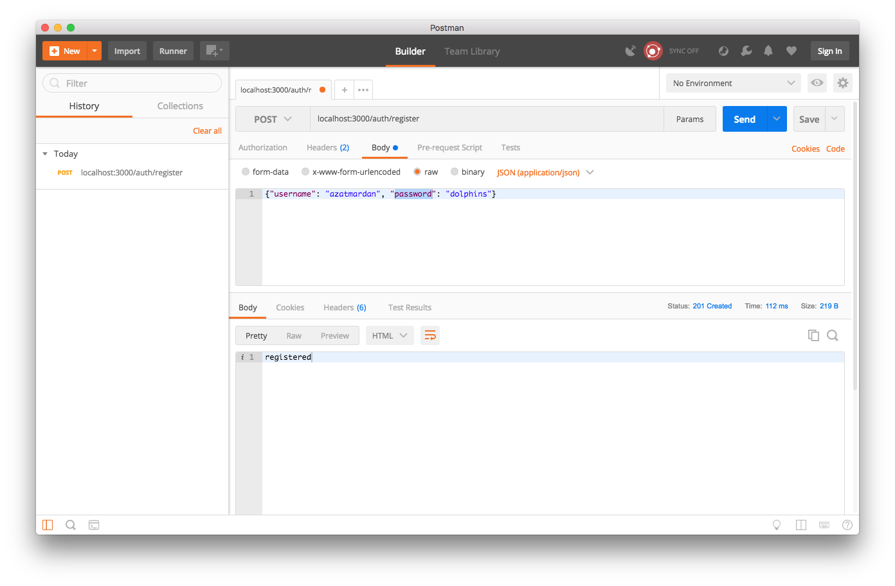
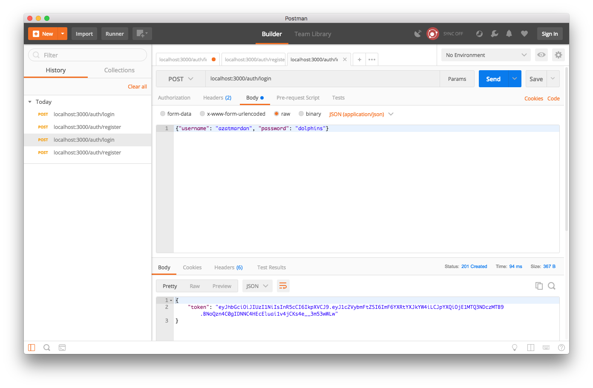
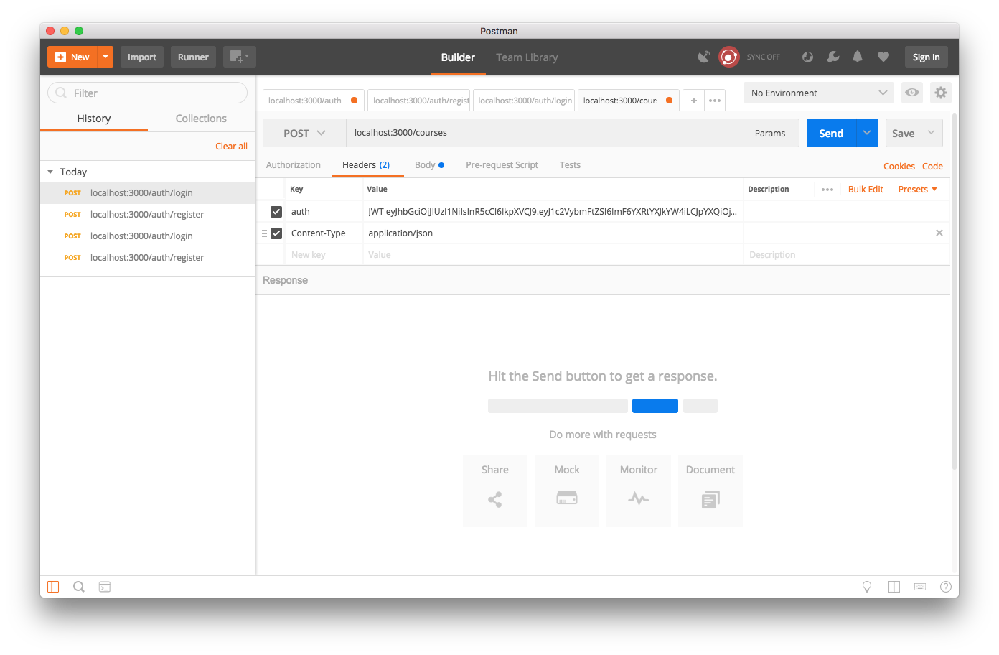
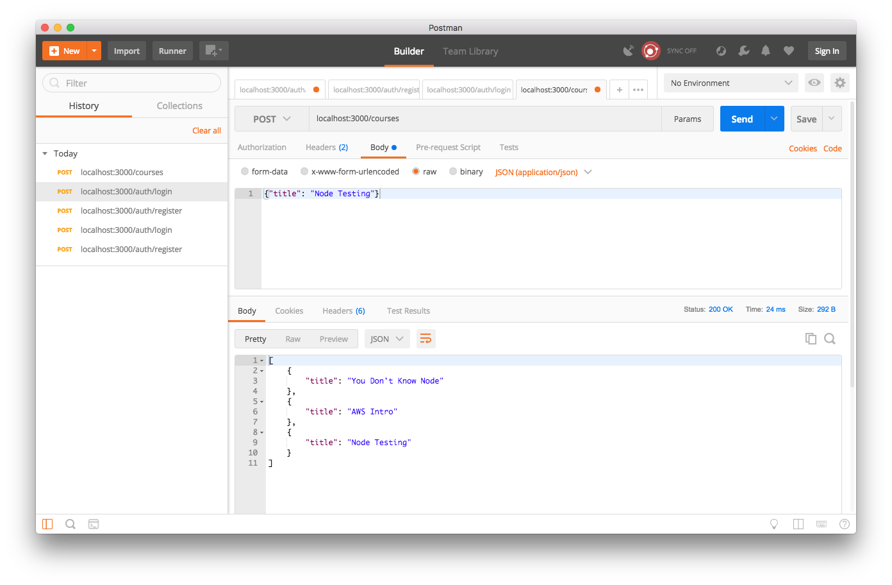
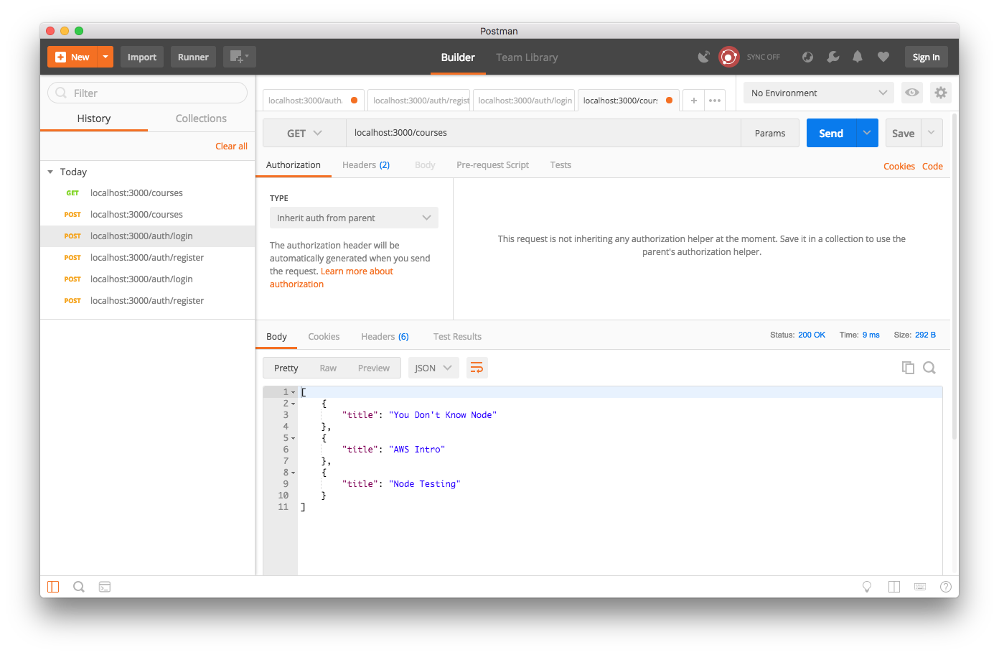
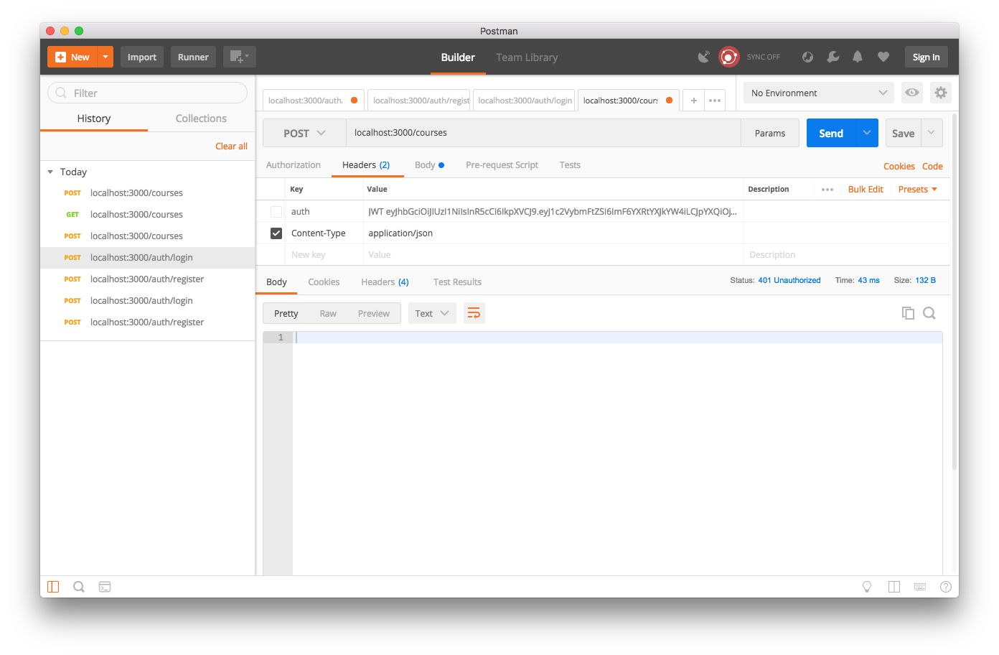
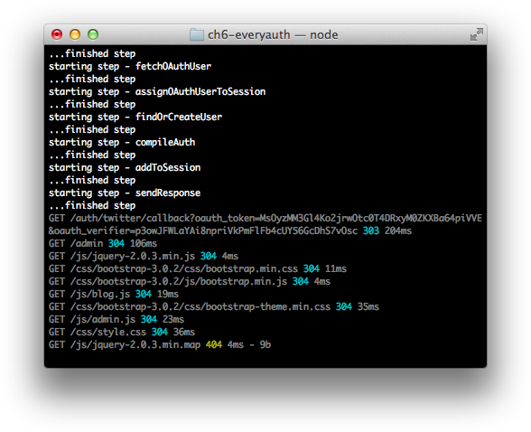

Chapter 6
---------
 # Using Sessions and OAuth to Authorize and Authenticate Users in Node.js Apps

Security is an important aspect of any real-world web application. This is especially true nowadays, because our apps don’t function in silos anymore. We, as developers, can and should leverage numerous third-party services (e.g., Google, Twitter, GitHub) or become service providers ourselves (e.g., provide a public API). 

We can makes our apps and communications secure with the usage of various approaches, such as token-based authentication and/or OAuth(<http://oauth.net>). Therefore, in this practical guide, I dedicate the whole chapter to matters of authorization, authentication, OAuth, and best practices. We'll look at the following topics:

- Authorization with Express.js middleware
- Token-based authentication
- Session-based authentication
- Project: adding e-mail and password login to Blog
- Node.js OAuth
- Project: Adding Twitter OAuth 1.0 sign-in to Blog with Everyauth (<https://github.com/bnoguchi/everyauth>)

# Authorization with Express.js Middleware

Authorization in web apps usually means restricting certain functions to privileged clients. These functions can either be methods, pages, or REST API end points.

Express.js middleware allows us to apply certain rules seamlessly to all routes, groups of routes (namespacing), or individual routes.

- *All routes*: `app.get('*', auth)`
- *Groups of routes*: `app.get('/api/*', auth)`
- *Individual routes*: `app.get('/admin/users', auth)`

For example, if we want to protect all `/api/` endpoints, we utilize the following middleware with `*`:

```js
app.all('/api/*', auth)
app.get('/api/users', users.list)
app.post('/api/users', users.create)
```    

Interestingly enough, `app.all()` with a URL pattern and an `*` is functionally the same as utilizing `app.use()` with a URL in a sense that they both will be triggered only on those URLs that are matching the URL pattern.

```js
app.use('/api', auth)
```

Another way of doing the same thing is to use `auth` middleware on each route which requires it:

```js
app.get('/', home) // no Auth needed
app.get('/api/users', auth, users.list) // Auth needed
app.post('/api/users', auth, users.create) // Auth needed
```

In the previous examples, `auth()` is a function with three parameters: `req`, `res`, and `next`—for example in this middleware, you can call OAuth service or query a database to get the user profile to authorize it (check for permissions) or to check for JWT or web session to authenticate the user (who is it). Or most likely do both!

```js
const auth = (req, res, next) => {
  // ...
  // Assuming you get user profile and user.auth is true or false
  if (user.auth) return next()
  else next(new Error('Not authorized')) // or res.send(401)
}
```

The `next()` part is important, because this is how Express.js proceeds to execute subsequent request handlers and routes (if there’s a match in a URL pattern). If `next()` is invoked without anything, then the normal execution of the server will proceed. That is Express will go to the next middleware and then to the routes which match the URL. 

If `next()` is invoked with an error object such as `next(new Error('Not authorized'))`, then Express will jump straight to the first error handler and none of the subsequent middleware or routes will be executed.

# Token-Based Authentication

For applications to know which privileges a specific client has (e.g., admin), we must add an authentication step. In the previous example, this step goes inside the `auth()` function.

The most common authentication is a cookie & session–based authentication, and the next section deals with this topic. However, in some cases, more REST-fulness is required, or cookies/sessions are not supported well (e.g., mobile). In this case, it’s beneficial to authenticate each request with a token (probably using the OAuth2.0 (<http://tools.ietf.org/html/rfc6749>)scheme). The token can be passed in a query string or in HTTP request headers. Alternatively, we can send some other authentication combination of information, such as e-mail/username and password, or API key, or API password instead of a token.

So, in our example of token-based authentication, each request can submit a token in a query string (accessed via `req.query.token`). And, if we have the correct value stored somewhere in our app (database, or in this example just a constant `SECRET_TOKEN`), we can check the incoming token against it. If the token matches our records, we call `next()` to proceed with the request executions, if not then we call `next(error)` which triggers Express.js error handlers execution (see the note below):

```js
const auth = (req, res, next) => {
  if (req.query.token && token === SECRET_TOKEN) {
    // client is fine, proceed to the next route
    return next()
  } else {
    return  next(new Error('Not authorized'))
      // or res.send(401)
  }
}
```


In a more realistic example, we use API keys and secrets to generate HMAC-SHA1 (hash-based message authentication code- secure hash algorithm strings, then compare them with the value in `req.query.token`.

**Note** Calling `next()` with an error argument is analogous to throwing in the towel (i.e., to give up). The Express.js app enters the error mode and proceeds to the error handlers.

We just covered token-based authentication, which is often used in REST APIs. However, the user-facing web apps (i.e., browser-enabled users & consumers) come with cookies. We can use cookies to store and send session IDs with each request. 

Cookies are similar to tokens, but require less work for us, the developers! This approach is the cornerstone of session-based authentication. The session-based method is the recommended way for basic web apps, because browsers already know what to do with session headers. In addition, in most platforms and frameworks, the session mechanism is built into the core. So, let’s jump straight into session-based authentication with Node.js.

# JSON Web Token (JWT) Authentication

JSON Web Tokens (JWT) allow to send and receive data which is encrypted and has all the necessary information, not just a token such as an API key. Thus, there's no need to store user information on the server. In my opinion, JWT less secure than have the data on the server and only storing the token (API key or session ID) on the client, because while JWT is encrypted anyone can break any encryption given enough time and CPU (albeit it might take 1000s of years).

Nevertheless, JWT is a very common technique to use for implementing web apps. They eliminate the need for the server-side database or store. All info is in this token. It has three parts: header, payload and signature. The encryption method (algorithm) vary depending on what you choose. It can be HS256, RS512, ES384, etc. I'm always paranoid about security so typically the higher the number the better. 

To implement a simple JWT login, let's use `jsonwebtoken` library for signing tokens and `bcrypt` for hashing passwords. When client wants to create an account, the system will take the password and hash it asynchronously so not to block the server from processing other requests (the slower the hashing the worse for attackers and the better for you). For example, this is how to get the password from the incoming request body and store the hash into the `users` array:

```js
app.post('/auth/register', (req, res) => {
    bcrypt.hash(req.body.password, 10, (error, hash)=>{
      if (error) return res.status(500).send()
      users.push({
        username: req.body.username,
        passwordHash: hash
      })
      res.status(201).send('registered')
    })
  })
``` 


Once the user record is created (which has the hash), we can login users to exchange the username and password for the JWT. They'll use this JWT for all other requests like a special key to authenticate and maybe unlock protected and restricted resources (that's authorization because not all users will have access to all the restricted resources).

The GET is not a protected route but POST is a protected route because there's an extra `auth` middleware there which will check for the JWT:

```js
app.get('/courses', (req, res) => {
    res.send(courses)
  })
app.post('/courses', auth, (req, res) => {
    courses.push({title: req.body.title})
    res.send(courses)
  })
```  

The login route checks for the presence of this username in the `users` array but this can be a database call or a call to another API not a simple `find()` method. Next, `bcrypt` has a `compare()` method which asynchronously checks for the hash. If they match (`matched == true`), then `jwt.sign` will issue a signed (encrypted) token which has username in it but can have many other fields not just one field. The `SECRET` string will be populated from the environment variable or from a public key later when the app goes to production. It's a `const` string for now. 

```js
app.post('/auth/login', (req, res) => {
    const foundUser = users.find((value, index, list) => {
      if (value.username === req.body.username) return true
      else return false
    })
    if (foundUser) {
      bcrypt.compare(req.body.password, foundUser.passwordHash, (error, matched) => {
        if (!error && matched) {
          res.status(201).json({token: jwt.sign({ username: foundUser.username}, SECRET)})
        } else res.status(401).send()
      })
    } else res.status(401).send()
  })
```

When you get this JWT you can make requests to POST /courses. The `auth` which check for JWT uses the `jwt` module and the data from the headers. The name of the header doesn't matter that much because I set the name myself in the `auth` middleware. Some developers like to use `Authorization` but it's confusing to me since we are not authorizing, but authenticating. The authorization, which is who can do what, is happening in the Node middleware. Here we are performing authentication which is who is this. It's me. Azat Mardan. 

```js
const auth = (req, res, next) => {
  if (req.headers && req.headers.auth && req.headers.auth.split(' ')[0] === 'JWT') {
    jwt.verify(req.headers.auth.split(' ')[1], SECRET, (error, decoded) => {
      if (error) return res.status(401).send()
      req.user = decoded
      console.log('authenticated as ', decoded.username)
      next()
    })
  }
  else return res.status(401).send()
}
```

You can play with the full working and tested code in `code/ch6/jwt-example`. I like to use CURL but most of my Node workshop attendees like Postman so in Figure 6-2 I show how to use Postman to extract the JWT (on login). And on Figure 6-3 put it to action (on POST /courses) by pasting the token into the header `auth` after `JTW ` (JWT with a space).

This is how to test the JWT example step by step in Postman (or any other HTTP client):

1. GET /courses will return a list of two courses which are in `server.js`
2. POST /courses with JSON data of `{"title": "blah blah blah"}` will return 401 Not Authorized. Now we know that this is a protected route and we need to create a new user to proceed
3. POST /auth/register with username and password will create a new user as shown in Figure 6-1. Next we can login (sign in) to the server to get the token
4. POST /auth/login with username and password which are matching existing records will return JWT as shown in Figure 6-2
5. POST /courses with title and JWT in the header will allow and create a new course recored (status 201) as shown in Figure 6-3 and Figure 6-4
6. GET /courses will show your new title. Verify it. No need for JWT for this request but it won't hurt either. Figure 6-5.
6. Celebrate and get a cup of tea with a (paleo) cookie.



***Figure 6-1.** Registering a new user by sending JSON payload*


***Figure 6-2.** Logging in to get JWT *


***Figure 6-3.** Using JWT in the header auth*


***Figure 6-4.** 200 status for the new course request with JWT in the header and the JSON payload*


***Figure 6-5.** Verifying new course*

Finally, you can uncheck the `auth` header which has the JWT value and try to make another POST /courses request as shown in Figure 6-6. The request will fail miserably (401) as it should because there's no JWT this time (see `auth` middleware in `server.js`).


***Figure 6-6.** Unchecking auth header with JWT leads to 401 as expected*

Don't forget to select `raw` and `application/json` when registering (POST /auth/register) and when making other POST requests. And now that you saw and know my password, please don't steal it. (It's not my actual password, but someone used dolphins as a password according to [this pull request "Remove my password from lists so hackers won't be able to hack me"](https://github.com/danielmiessler/SecLists/pull/155)).

JWT is easy to implement. Once on the client after the login request, you can store JWT in local storage or cookies (in the browser) so that your React, Vue, or Angular front-end app can send this token with each request. Protect your secret and pick a strong encryption algorithms to make it harder for attachers to hack your JWT data. 

For me sessions are somewhat more secure because I store my data on the server, on encrypted on the client.

# Session-Based Authentication

Session-based authentication is done via the `session` object in the request object `req`. A web session in general is a secure way to store information about a client so that subsequent requests from that same client can be identified.

In the Express.js file, we'll need to import (`require()`) two modules to enable sessions. We need to include and use `cookie-parser` and `express-session`. 

1. `express.cookieParser()`: allows for parsing of the client/request cookies
2. `express.session()`: exposes the `res.session` object in each request handler, and stores data in the app memory or some other persistent store like MongoDB or Redis

Note: in `express-session` version 1.5.0 and higher, there's no need to add the `cookie-parser` middleware. In fact, it might lead to some bad behavior. So it's recommended to use `express-sesison` by itself because it will parse and read cookie by itself.

Needless to say, `cookie-parser` and `express-session` must be installed via npm into the project's `node_modules` folder, i.e., you need to install them with `npm i cookie-parser express-session -SE`.


Import with `require()` and apply to the Express app with `app.use()`:

```js
const cookieParser = require('cookie-parser')
const session = require('express-session')
...
app.use(cookieParser())
app.use(session())
```


The rest is straightforward. We can store any data in `req.session` and it appears automagically on each request from the same client (assuming their browser supports cookies). Hence, the authentication consists of a route that stores some flag (true/false) in the session and of an authorization function in which we check for that flag (if true, then proceed; otherwise, exit). For example,

```js
app.post('/login', (req, res, next) => {
  if (checkForCredentials(req)) {  // This function checks for credentials passed in the request's payload
    req.session.auth = true
    res.redirect('/dashboard') // Private resource
  } else {
    res.status(401).send() // Not authorized
  }
})
```

**Warning** Avoid storing any sensitive information in cookies. The best practice is not to store any info in cookies manually—except session ID, which Express.js middleware stores for us automatically—because cookies are not secure. Also, cookies have a size limitation (depending on the browser, with Internet Explore being the stringiest) that is very easy to reach.

By default, Express.js uses in-memory session storage. This means that every time an app is restarted or crashes, the sessions are wiped out. To make sessions persistent and available across multiple servers, we can use Redis for MongoDB for as session restore.

# Project: Adding E-mail and Password Login to Blog

To enable session-based authentication in Blog, we need to do the following:

1. Import and add the session middleware to the configuration part of `app.js`.
2. Implement the authorization middleware `authorize` with a session-based authorization so we can re-use the same code for many routes
3. Add the middleware from #2 (step above) to protected pages and routes in `app.js` routes, e.g., `app.get('/api/, authorize, api.index)`.
4. Implement an authentication route POST `/login`, and a logout route, GET `/logout` in `user.js`.

We will start with the session middleware.

## Session Middleware

Let’s add the automatic cookie parsing and support for session middleware in these two lines by putting them in the middle of configurations in `app.js`:

```js
const cookieParser = require('cookie-parser')
const session = require('express-session')
// Other middleware
app.use(cookieParser('3CCC4ACD-6ED1-4844-9217-82131BDCB239'))
app.use(session({secret: '2C44774A-D649-4D44-9535-46E296EF984F'}))
// Routes
```

**Warning** You should replace randomly generated values with your own ones.

`session()` must be preceded by `cookieParser()` because session depend on cookies to work properly. For more information about these and other Express.js/Connect middleware, refer to Pro Express.js 4 [Apress, 2014].

Beware of another cookies middleware. It's name is `cookie-sesison`. It's not as secure as `cookie-parser` and `express-session`. `cookie-session` can be used in some cases but I don't recommend it because it stores all information in the cookie, not on the server. The usage is import and apply:

```js
const cookieSession = require('cookie-session')
app.use(cookieSession({secret: process.env.SESSION_SECRET}))
``` 

Again, the difference is that `express-session` uses secure in-memory or Redis storage—and cookies store only for the session ID, i.e., `sid`—whereas `cookie-session` uses browser cookies to store session information. In other words, the entire session is serialized into cookie-based storage, not just the session key. This approach should be avoided because of cookie size limitations and security concerns.

It’s useful to pass request authentication information to the templates. We can do so by adding middleware that checks the `req.session.admin` value for truthyness and adds an appropriate property to `res.locals`:

```js
app.use(function(req, res, next) {
  if (req.session && req.session.admin)
    res.locals.admin = true
  next()
})
```

Let's add authorization to the Blog project.

## Authorization in Blog

Authorization is also done via middleware, but we won’t set it up right away with `app.use()` like we did in the snippet for `res.locals`. Instead, we define a function that checks for `req.session.admin` to be true, and proceeds if it is. Otherwise, the 401 Not Authorized error is thrown and the response is ended.

```js
// Authorization
const authorize = (req, res, next) => {
  if (req.session && req.session.admin)
    return next()
  else
    return res.send(401)
}
```    

Now we can add this middleware to certain protected endpoints (another name for routes). Specifically, we will protect the endpoints to see the admin page (GET `/admin`), to create a new article (POST `/post`) and to see the create new article page (GET `/post`):

```js
app.get('/admin', authorize, routes.article.admin)
app.get('/post', authorize, routes.article.post)
app.post('/post', authorize, routes.article.postArticle)
```

We add the authorize middleware to API routes as well... to *all* of them using `app.all()`:

```js
app.all('/api', authorize)
app.get('/api/articles', routes.article.list)
app.post('/api/articles', routes.article.add)
app.put('/api/articles/:id', routes.article.edit)
app.delete('/api/articles/:id', routes.article.del)
```

The `app.all('/api', authorize)` is a more compact alternative to adding `authorize` to all `/api/...` routes manually. Less copy-paste and more code re-usage please.

I know there are a lot of readers who like to see entire source code. Thus, the full source code of the `app.js` file after adding session support and authorization middleware is as follows (under the `ch6/blog-password` folder):

```js
const express = require('express')
const routes = require('./routes')
const http = require('http')
const path = require('path')
const mongoskin = require('mongoskin')
const dbUrl = process.env.MONGOHQ_URL || 'mongodb://@localhost:27017/blog'

const db = mongoskin.db(dbUrl)
const collections = {
  articles: db.collection('articles'),
  users: db.collection('users')
}

const cookieParser = require('cookie-parser')
const session = require('express-session')
const logger = require('morgan')
const errorHandler = require('errorhandler')
const bodyParser = require('body-parser')
const methodOverride = require('method-override')

const app = express()
app.locals.appTitle = 'blog-express'

// Expose collections to request handlers
app.use((req, res, next) => {
  if (!collections.articles || !collections.users) return next(new Error('No collections.'))
  req.collections = collections
  return next()
})

// Express.js configurations
app.set('port', process.env.PORT || 3000)
app.set('views', path.join(__dirname, 'views'))
app.set('view engine', 'pug')

// Express.js middleware configuration
app.use(logger('dev'))
app.use(bodyParser.json())
app.use(bodyParser.urlencoded({extended: true}))
app.use(methodOverride())
app.use(require('stylus').middleware(path.join(__dirname, 'public')))
app.use(express.static(path.join(__dirname, 'public')))
app.use(cookieParser('3CCC4ACD-6ED1-4844-9217-82131BDCB239'))
app.use(session({secret: '2C44774A-D649-4D44-9535-46E296EF984F',
  resave: true,
  saveUninitialized: true}))

// Authentication middleware
app.use((req, res, next) => {
  if (req.session && req.session.admin) { 
    res.locals.admin = true 
  }
  next()
})

// Authorization Middleware
const authorize = (req, res, next) => {
  if (req.session && req.session.admin)
    return next()
  else
    return res.status(401).send()
}

if (app.get('env') === 'development') {
  app.use(errorHandler())
}

// PAGES&ROUTES
app.get('/', routes.index)
app.get('/login', routes.user.login)
app.post('/login', routes.user.authenticate)
app.get('/logout', routes.user.logout)
app.get('/admin', authorize, routes.article.admin)
app.get('/post', authorize, routes.article.post)
app.post('/post', authorize, routes.article.postArticle)
app.get('/articles/:slug', routes.article.show)

// REST API ROUTES
app.all('/api', authorize)
app.get('/api/articles', routes.article.list)
app.post('/api/articles', routes.article.add)
app.put('/api/articles/:id', routes.article.edit)
app.delete('/api/articles/:id', routes.article.del)

app.all('*', function (req, res) {
  res.status(404).send()
})

// http.createServer(app).listen(app.get('port'), function(){
  // console.log('Express server listening on port ' + app.get('port'));
// });

const server = http.createServer(app)
const boot = function () {
  server.listen(app.get('port'), function () {
    console.info(`Express server listening on port ${app.get('port')}`)
  })
}
const shutdown = function () {
  server.close(process.exit)
}
if (require.main === module) {
  boot()
} else {
  console.info('Running app as a module')
  exports.boot = boot
  exports.shutdown = shutdown
  exports.port = app.get('port')
}
```

Now we can implement authentication (different from authorization).

## Authentication in Blog

The last step in session-based authorization is to allow users and clients to turn the `req.session.admin` switch on and off. We do this by having a login form and processing the POST request from that form. 

For authenticating users as admins we set the appropriate flag (`admin=true`), in the `routes.user.authenticate` in the `user.js` file. This is done in the POST `/login` route which we defined in the `app.js`—a line that has this statement: 

```
app.post('/login', routes.user.authenticate)
```

In `user.js`, expose the method to the importer, i.e., the file that imports this `user.js` module:

```js
exports.authenticate = (req, res, next) => {
```

The form on the login page submits data to this route. In general, a sanity check for the input values is always a good idea. If values are falsy (including empty values), we'll render the login page again with the message `error`. 

The `return` keyword ensures the rest of the code in this method isn’t executed. If the values non-empty (or otherwise truthy), then the request handler will not terminate yet and proceed to the next statements:

```js
exports.authenticate = (req, res, next) => {
  if (!req.body.email || !req.body.password)
    return res.render('login', {
      error: 'Please enter your email and password.'
    })
```

Thanks to the database middleware in `app.js`, we can access database collections in `req.collections`. In our app’s architecture, e-mail is a unique identifier (there are no two accounts with the same e-mail), so we use the `findOne()` function to find a match of the e-mail and password combination (logical AND):

```js
  req.collections.users.findOne({
    email: req.body.email,
    password: req.body.password
  }, (error, user) => {
```

**Warning** In virtually all cases, we don’t want to store passwords as a plain text; we should store salts and password hashes instead. In this way, if the database gets compromised, passwords are not seen. For salting, use the core Node.js module crypto.

`findOne()` returns an error object and the `user` result object. However, we should still do error processing manually:

```js
    if (error) return next(error)
    if (!user) return res.render('login', {error: 'Incorrect email&password combination.'})
```

If the program has made it thus far (avoided a lot of `return` statements previously), we can authenticate the user as administrator thus enabling the authentication and the `auth` (authorization) method:

```js
    req.session.user = user
    req.session.admin = user.admin
    res.redirect('/admin')
  })
}
```

The `logout` route is trivial. We clear the session by calling `destroy()` on `req.session`:

```js
exports.logout = (req, res, next) => {
  req.session.destroy()
  res.redirect('/')
}
```

The full source code of `code/ch6/blog-password/routes/user.js` for your reference is as follows:

```js
exports.list = function (req, res) {
  res.send('respond with a resource')
}

exports.login = function (req, res, next) {
  res.render('login')
}

exports.logout = function (req, res, next) {
  req.session.destroy()
  res.redirect('/')
}

exports.authenticate = function (req, res, next) {
  if (!req.body.email || !req.body.password) { return res.render('login', {error: 'Please enter your email and password.'}) }
  req.collections.users.findOne({
    email: req.body.email,
    password: req.body.password
  }, function (error, user) {
    if (error) return next(error)
    if (!user) return res.render('login', {error: 'Incorrect email&password combination.'})
    req.session.user = user
    req.session.admin = user.admin
    res.redirect('/admin')
  })
}
```

It's better to test the enhancements earlier. Everything should be ready for running the app.

## Running the App

Now everything should be set up properly to run Blog. Contrary to the example in Chapter 5, we see protected pages only when we’re logged in. These protected pages enable us to create new posts, and to publish and unpublish them. But as soon as we click "Logout" in the menu, we no longer can access the administrator page. 

The executable code is under the `code/ch6/blog-password` folder of the `practicalnode` repository: https://github.com/azat-co/practicalnode.

# Node.js OAuth

OAuth ([npm](https://www.npmjs.org/package/oauth) (<https://www.npmjs.org/package/oauth>), [GitHub](https://github.com/ciaranj/node-oauth) (<https://github.com/ciaranj/node-oauth>)) is the powerhouse of OAuth 1.0/2.0 schemes for Node.js. It’s a module that generates signatures, encryptions, and HTTP headers, and makes requests. 

We still need to initiate the OAuth dances (i.e., requests back and forth between consumer, provider and our system), write the callback routes, and store information in sessions or databases. Refer to the service provider’s (e.g., Facebook, Twitter, Google) documentation for end points, methods, and parameter names.

It is recommended that `node-auth` be used when complex integration is needed or when only certain pieces of OAuth are needed (e.g., header signatures are generated by node-auth, but the request is made by the `superagent` library).

To add OAuth version 0.9.15 (the latest as of this writing) to your project, simply run:

```
$ npm install oauth@0.9.15
```

## Twitter OAuth 2.0 Example with Node.js OAuth

OAuth 2.0 is less complicated and, some might argue, less secure than OAuth 1.0. The reasons for this are numerous and better understood when written by Eran Hammer, the person who participated in OAuth2.0 creation: OAuth 2.0 and the Road to Hell.

In essence, OAuth 2.0 is similar to the token-based authorization we examined earlier, for which we have a single token, called a *bearer*, that we pass along with each request. To get that token, all we need to do is exchange our app’s token and secret for the bearer. 

Usually, this bearer can be stored for a longer time than OAuth 1.x tokens (depends on the rules set by a specific service-provider), and can be used as a single key/password to open protected resources. This bearer acts as our token in the token-based auth.

Here’s an ordinary example from [Node.js OAuth](https://github.com/ciaranj/node-oauth#oauth20) (<https://github.com/ciaranj/node-oauth#oauth20>). (`node-auth`) docs. First, we create an `oauth2` object that has a Twitter consumer key and secret (replace the values with yours):

```js
const OAuth = require('oauth')
const OAuth2 = OAuth.OAuth2
const twitterConsumerKey = 'your key'
const twitterConsumerSecret = 'your secret'
const oauth2 = new OAuth2(twitterConsumerKey,
  twitterConsumerSecret,
  'https://api.twitter.com/',
  null,
  'oauth2/token',
  null
)
```

Then, we request access to the token/bearer from the service provider:

```js
oauth2.getOAuthAccessToken(
  '',
  {'grant_type': 'client_credentials'},
  function (e, access_token, refresh_token, results) {
    console.log('bearer: ', access_token)
    // Store bearer
    // Make OAuth2 requests using this bearer to protected endpoints
  }
)
```

Now we can store the bearer for future use and make requests to protected end points with it.

**Note** Twitter uses OAuth2.0 for the so called app-only authorizations which are requests to protected resources. Those requests are made on behalf of the applications only (not on behalf of users by the apps). Twitter uses OAuth 1.0 for normal auths, i.e., requests made on behalf of the users by the app). Not all endpoints are available via app-only auth, and quotas/limitations are different. Please refer to the official documentation at <http://dev.twitter.com>.

## Everyauth

The Everyauth module allows for multiple OAuth strategies to be implemented and added to any Express.js app in just a few lines of code. Everyauth comes with strategies for most of the service providers, so there’s no need to search and implement service provider-specific end points, parameters names, and so forth. Also, Everyauth stores user objects in a session, and database storage can be enabled in a `findOrCreate` callback using a promise pattern.

**Tip** Everyauth has an e-mail and password strategy that can be used instead of the custom-built auth. More information about it can be found in Everyauth documentation at the [GitHub repository](https://github.com/bnoguchi/everyauth#password-authentication) (<https://github.com/bnoguchi/everyauth#password-authentication>).

Everyauth has lots fo submodules which describe how a service might use OAuth exactly. Each one of them might be different. If you just use one of this submodule then you don't need to worry about the details. Instead you just plug in your app secret and client ID and boom! You are rolling.  In other words, submodules enable service provider-specific authorization strategies and there are tons of these submodules (strategies): password (simple email and password), Facebook, Twitter, Google, Google Hybrid, LinkedIn, Dropbox, Tumblr, Evernote, GitHub, Instagram, Foursquare, Yahoo!, Justin.tv, Vimeo, 37signals (Basecamp, Highrise, Backpack, Campfire), Readability, AngelList, Dwolla, OpenStreetMap, VKontakte (Russian social network famous for its pirated media), Mail.ru (Russian social network), Skyrock, Gowalla, TripIt, 500px, SoundCloud, mixi, Mailchimp, Mendeley, Stripe, Datahero, Salesforce, Box.net, OpenId, and event LDAP and Windows Azure Access Control Service! and more at <https://github.com/bnoguchi/everyauth/blob/master/README.md>.

# Project: Adding Twitter OAuth 1.0 Sign-in to Blog with Everyauth

A typical OAuth 1.0 flow consists of these three steps (simplified):

1. Users go to a page/route to initiate the OAuth dance. There, our app requests a token via GET/POST requests using the signed app’s consumer key and secret. For example, `/auth/twitter` is added automatically by Everyauth.
2. The app uses the token extracted in step 1 and redirects users to the service-provider (Twitter) and waits for the callback.
3. The service provider redirects users back to the app which catches the redirect in the callback route (e.g., `/auth/twitter/callback`). Then, the app extracts the access token, the access token secret, and the user information from the Twitter incoming request body / payload.

However, because we’re using Everyauth, we don’t need to implement requests for the initiate and the callback routes!

Let’s add a Sign in with Twitter button to our project. We need the button itself (image or a link), app key, and secret (obtainable at dev.twitter.com), and then we must augment our authorization route to allow for specific Twitter handlers to be administrated on Blog.

## Adding a Sign-in with a Twitter Link

By default, Everyauth uses the `/auth/:service_provider_name` pattern to initiate the three-legged OAuth 1.0 strategy. This, of course, can be customized, but to keep it short and simple (KISS), we can just add this link to `code/ch6/blog-everyauth/views/includes/menu.pug`:

```pug
      li(class=(menu === 'login') ? 'active' : '')
        a(href='/auth/twitter') Sign in with Twitter
```

The whole `menu.pug` has if/else ternary expressions and looks like this:

```pug
.menu
  ul.nav.nav-pills
    li(class=(menu === 'index') ? 'active' : '')
      a(href='/') Home
    if (admin)
      li(class=(menu === 'post') ? 'active' : '')
        a(href="/post") Post
      li(class=(menu === 'admin') ? 'active' : '')
        a(href="/admin") Admin
      li
        a(href="/logout") Log out
    else
      li(class=(menu === 'login')? 'active' : '')
        a(href='/login') Log in
      li
        a(href='/auth/twitter') Sign in with Twitter
```

## Configuring the Everyauth Twitter Strategy

To add the Everyauth module (`everyauth)` to Blog, type the following in the terminal:

```
$ npm i everyauth@0.4.9 -SE
```


The configuration of the Everyauth Twitter strategy is implemented in `app.js`, but in larger apps it’s a good idea to abstract these types of strategies into separate files. The most important thing to remember is that Everyauth middleware needs to precede the `app.route` call.

To procure the Twitter app consumer key and secret, we harness environmental variables via `process.env`:

```js
const TWITTER_CONSUMER_KEY = process.env.TWITTER_CONSUMER_KEY
const TWITTER_CONSUMER_SECRET = process.env.TWITTER_CONSUMER_SECRET
```

To pass these variables we can use Makefile. In the Makefile, add these lines, substituting ABC and XYZ with your values:

```
start:
    TWITTER_CONSUMER_KEY=ABCABC \
    TWITTER_CONSUMER_SECRET=XYZXYZXYZ \
    node app.js
```

Also, add the `start` command to `.PHONY`:

```
.PHONY: test db start
```

As another option, we can create a Bash file `start.sh`:

```
TWITTER_CONSUMER_KEY=ABCABC \
TWITTER_CONSUMER_SECRET=XYZXYZXYZ \
node app.js
```

Now we go back to the `app.js` file, in which we need to import the Everyauth module:

```js
everyauth = require('everyauth')
```

It’s a good practice to run the module in debug mode the first few times:

```js
everyauth.debug = true
```

Each submodule is enabled using chained commands and promises. To define the previously mentioned key and secret, execute the following:

```js
everyauth.twitter
  .consumerKey(TWITTER_CONSUMER_KEY)
  .consumerSecret(TWITTER_CONSUMER_SECRET)
```

Then, to tell the module what to do when Twitter sends back the authorized user object `twitterUserMetadata`, type

```js
  .findOrCreateUser((session, 
    accessToken, 
    accessTokenSecret, 
    twitterUserMetadata) => {
```

We can return the user object right away, but to emulate async writing to a database, let’s create a promise

```js
        const promise = this.Promise()
```

and use the `process.nextTick` call, which is analogous to `setTimeout(callback, 0);`, and acts in an asynchronous manner. In a real-world app, you might want to find or save the data to the database:

```js
    process.nextTick(function(){
```

Change Azat’s username to yours:

```js
        if (twitterUserMetadata.screen_name === 'azat_co') {
```

Store the `user` object in the in-memory session, just like we did in the `/login` route:

```js
          session.user = twitterUserMetadata
```

The most important, set admin flag to `true`:

```js
          session.admin = true
        }
```

Everyauth expects us to fulfill the promise when it’s ready:

```js
        promise.fulfill(twitterUserMetadata)
    })
    return promise
    // return twitterUserMetadata
  })
```

After all the steps are done, instruct Everyauth where to redirect the user:

```js
  .redirectPath('/admin')
```

Everyauth is so smart that it automatically adds a `/logout` route, this means our route (`app.get('/logout', routes.user.logout);`) won't be used. So we need to add some extra logic to the default Everyauth strategy. Otherwise, the session will always keep admin = true. In the `handleLogout` step, we clear our session by calling the exact same method from `user.js`:

```js
everyauth.everymodule.handleLogout(routes.user.logout)
```

The next line tells Everyauth how to find a user object based on the `user` argument, but because we stored the whole user object in the session and we don’t store user info in `findOrCreate`, we can just return back the same object:

```js
everyauth.everymodule.findUserById( (user, callback) => {
  callback(user)
})
```

Last but not least, the line that follows, enable Everyauth routes and it must go after cookie and session middleware but must come before normal routes (e.g., `app.get(), app.post()`):

```js
app.use(everyauth.middleware())
```

The full source code of the `code/ch6/blog-everyauth/app.js` file after adding the Everyauth Twitter OAuth1.0 strategy is rather lengthy thus is not listed here but can be found on GitHub.


To run the app, execute `$ make start`, and **don’t forget to replace** the Twitter username, consumer key, and secret with yours. Then when you click on "Sign in with Twitter", you'll be redirected to Twitter to authorize this application. Then you'll be redirected back to the localhost app and should see the admin page menu. We have been authorized by a third-party service provider! 

Also, the user information is available to your app so it can be stored in the database for future usage. If you already gave permissions, the redirect to and from Twitter might happen very fast. The terminal output is shown in Figure 6-1 shows each step of Everyauth process such as getting tokens and sending responses. Each step can be customized to your app's needs.



***Figure 6-1.** Everyauth Twitter strategy with debug mode in action*

Auths are important. Good job. 

# Summary

In this chapter, we learned how to implement a standard e-mail and password authentication, and used Express.js middleware to protect sensitive pages and end points in Blog. Then, we covered OAuth 1.0 and OAuth 2.0 with Everyauth and OAuth modules, respectively. 

Now we have a few security options for Blog. In the next chapter we'll explore Mongoose (<http://mongoosejs.com>) object-relational mapping object-document mapping (ODM) Node.js library for MongoDB. 

The Mongoose library is a good choice for complex systems with a lot of interdependent business logic between entities, because it completely abstracts the database and provides developers with tools to operate with data only via Mongoose objects. The chapter will touch on the main Mongoose classes and methods, explain some of the more advanced concepts, and re-factor persistence in Blog.
